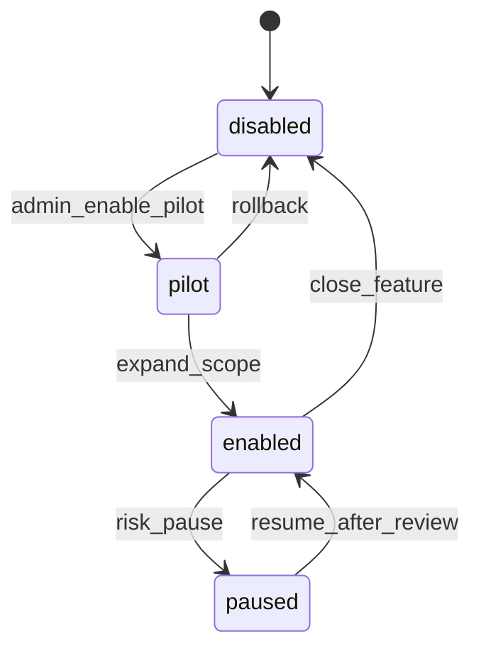

# Admin Feature Flag API Design

日期：2026-05-03

本文设计中国本地化平台的模块开关和能力视图 API。本文只做合同设计，不写业务代码、不创建 migration、不修改支付、订单、退款、结算、佣金、权限逻辑。

## 目标

- 让 Admin 能按平台、市场、商户维度管理模块开关。
- 让 Vendor 只看到自己当前市场、当前商户身份下可用的能力。
- 让 Storefront 只看到公开市场能力，不泄露内部风控原因。
- 确保所有真实能力由后端拒绝或放行，前端隐藏入口只作为体验优化。

## 核心规则

- Feature flag 必须服务端计算，不能只靠前端菜单隐藏。
- 写操作必须经过权限校验、风险分级、二次确认和审计日志。
- 读接口按调用方返回裁剪后的 capability view。
- 高风险能力默认 `disabled`，包括真实支付、退款、结算、佣金、直播推流、短信、物流、AI 自动发布。
- AI 上架只允许生成草稿，真实发布必须走商户确认和既有商品发布流程。
- 支付成功必须以后端异步通知为准，任何前端开关不得改变该原则。

## 能力键建议

| key | 默认状态 | 风险 | 说明 |
| --- | --- | --- | --- |
| `storefront_market_switch` | enabled | low | 前台市场切换 |
| `shop_decoration` | pilot | medium | 商家店铺装修 |
| `mobile_quick_listing` | pilot | medium | 手机快速上架 |
| `ai_listing_draft` | pilot | medium | AI 生成商品草稿 |
| `pickup_card_fulfillment` | pilot | medium | 提货卡提货履约 |
| `shop_live_status` | disabled | medium | 店铺直播状态标签 |
| `materials_procurement` | disabled | medium | 商户物料采购 |
| `materials_supplier_orders` | disabled | medium | 物料供应商接单 |
| `delivery_supplier_orders` | disabled | medium | 配送供应商接单 |
| `waybill_printing` | disabled | medium | 快递打印 |
| `upstream_source_quotes` | disabled | medium | 养殖户/种植户报价对接 |
| `seedling_wholesale` | disabled | medium | 种苗批发 |
| `regional_wholesaler_connection` | disabled | medium | 外地批发商对接 |
| `real_wechat_pay` | disabled | high | 真实微信支付 |
| `real_alipay` | disabled | high | 真实支付宝 |
| `real_refund` | disabled | high | 真实退款 |
| `settlement_payout` | disabled | high | 商家结算打款 |

## API 合同

### Admin 读取

```http
GET /admin/china/feature-flags
GET /admin/china/markets/:market_id/feature-flags
GET /admin/china/merchants/:merchant_id/feature-flags?market_id=...
GET /admin/china/feature-flags/audit-logs?scope_type=market&scope_id=...
```

Admin 返回内部字段：

```json
{
  "capabilities": [
    {
      "key": "mobile_quick_listing",
      "label": "手机快速上架",
      "state": "pilot",
      "scope_type": "market",
      "scope_id": "market_sanmen",
      "risk_level": "medium",
      "requires_provider": false,
      "requires_backend_permission": true,
      "disabled_reason": null,
      "updated_at": "2026-05-03T10:00:00+08:00"
    }
  ]
}
```

### Admin 写入

```http
PUT /admin/china/markets/:market_id/feature-flags/:key
PUT /admin/china/merchants/:merchant_id/feature-flags/:key?market_id=...
```

请求体：

```json
{
  "state": "enabled",
  "reason": "三门市场试点开放手机快速上架",
  "confirm_token": "operator-confirmed-risk",
  "idempotency_key": "flag-20260503-0001"
}
```

服务端要求：

- 校验操作者是否有平台配置权限。
- 校验 capability 是否存在、风险级别是否允许当前环境打开。
- 中高风险能力需要 `reason` 和二次确认。
- 写入前后状态必须写入 `CapabilityAuditLog`。
- 同一个 `idempotency_key` 重试必须返回同一结果，不能重复写审计。

### Vendor 读取

```http
GET /vendor/china/capability-view?market_id=...
```

Vendor 返回裁剪后的能力视图：

```json
{
  "market_id": "market_sanmen",
  "merchant_id": "merch_001",
  "merchant_type": "seafood",
  "capabilities": {
    "mobile_quick_listing": true,
    "ai_listing_draft": true,
    "materials_supplier_orders": false,
    "delivery_supplier_orders": false
  },
  "labels": {
    "mobile_quick_listing": "手机快速上架",
    "ai_listing_draft": "AI 草稿上架"
  },
  "computed_at": "2026-05-03T10:00:00+08:00"
}
```

Vendor 不应看到内部风控原因、其他商户能力、平台默认配置。

### Storefront 读取

```http
GET /store/china/markets/:market_id/public-capabilities
```

Storefront 返回公开能力：

```json
{
  "market_id": "market_sanmen",
  "public_capabilities": {
    "storefront_market_switch": true,
    "shop_live_status": true,
    "pickup_card_fulfillment": true
  },
  "announcement": "今日正常营业，冷链配送时效以商家接单为准。"
}
```

Storefront 不应读取 Admin 内部开关理由和商户级敏感配置。

## 状态机



状态含义：

- `disabled`: 不可见，后端写操作拒绝。
- `pilot`: 对部分市场/商户/角色可见，后端按能力视图放行。
- `enabled`: 范围内可见且后端放行。
- `paused`: 临时暂停，保留配置但后端拒绝写操作。

## 后端拒绝策略

每个真实写 API 在执行前应调用 capability guard：

```ts
await assertCapability({
  actorId,
  actorRole,
  marketId,
  merchantId,
  capabilityKey: "mobile_quick_listing",
  action: "product.create_draft",
})
```

Guard 返回：

- allow: 继续执行业务写操作。
- deny: 返回稳定错误码，如 `CAPABILITY_DISABLED`。
- audit: 对中高风险 deny 可记录安全审计。

## 审计日志字段

- `id`
- `scope_type`: `platform`、`market`、`merchant`
- `scope_id`
- `capability_key`
- `before_state`
- `after_state`
- `operator_id`
- `operator_role`
- `reason`
- `idempotency_key`
- `trace_id`
- `ip_hash`
- `created_at`

## PR 拆分

1. 文档和 API 合同。
2. capability model + migration 草案。
3. Admin 只读接口。
4. Vendor capability view 只读接口。
5. Storefront public capability 只读接口。
6. Admin 写接口 + 审计日志。
7. capability guard 接入低风险写 API。
8. 高风险模块逐个串行接入。

## 验证

- 文档 PR：`git diff -- docs .codex`
- API 合同 PR：Admin/Vendor/Storefront 返回样例快照测试。
- 写接口 PR：权限拒绝、幂等重试、审计日志、风险二次确认测试。
- Guard 接入 PR：模块关闭时后端拒绝对应写操作。
