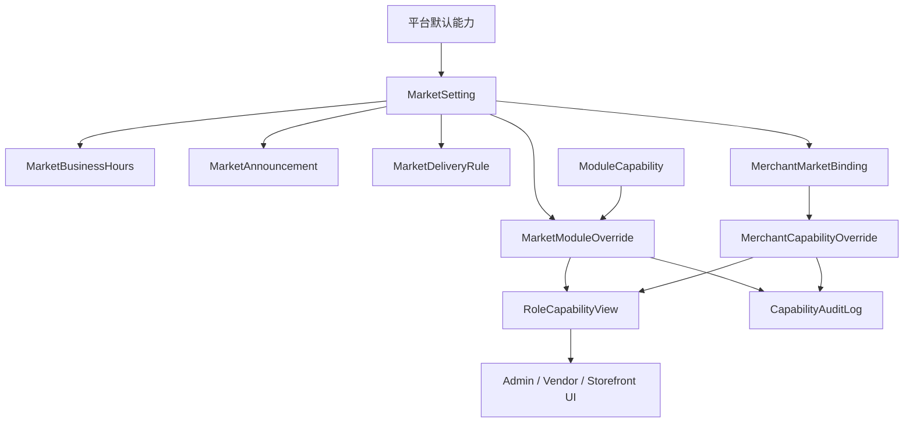

# Admin 市场配置与模块开关后端设计

日期：2026-05-03

## 目标

为中国本地化平台设计市场配置、模块开关和角色能力开关的后端模型。本文只做架构设计，不创建 migration、不接运行时 API、不修改权限、订单、支付、退款、结算、佣金逻辑。

## 核心原则

- 前端隐藏入口不是权限控制。真实开关必须由后端配置、权限判断和审计日志共同决定。
- 平台能力按平台默认、市场覆盖、商户覆盖、角色视图逐层收敛。
- 市场是核心租户边界之一。商户可跨多个市场，但每个市场内有独立档口号、营业状态、配送规则和公告。
- 高风险能力默认关闭，例如真实支付、退款、结算、佣金、直播推流、短信、物流、AI 自动发布。
- 所有开关变更必须记录操作者、范围、前后值、原因和时间。

## 概念模型

## 建议数据模型

### MarketSetting

表示一个可切换市场。

建议字段：

- `id`
- `code`
- `name`
- `city`
- `district`
- `address`
- `status`: `draft`、`active`、`paused`、`archived`
- `service_phone_masked`
- `default_timezone`: 默认 `Asia/Shanghai`
- `metadata`
- `created_at`、`updated_at`

### MarketBusinessHours

表示市场营业时间。

建议字段：

- `id`
- `market_id`
- `weekday`
- `open_at`
- `close_at`
- `break_windows`
- `holiday_rule`
- `status`

### MarketAnnouncement

表示市场公告。

建议字段：

- `id`
- `market_id`
- `title`
- `content`
- `display_scope`: `storefront`、`vendor`、`admin`
- `starts_at`
- `ends_at`
- `status`
- `created_by`

### MarketDeliveryRule

表示市场配送、自提、冷链和快递规则。

建议字段：

- `id`
- `market_id`
- `delivery_mode`: `market_pickup`、`local_delivery`、`cold_chain`、`express`
- `service_area`
- `time_windows`
- `temperature_band`: `ambient`、`chilled`、`frozen`
- `packaging_required`
- `provider_key`
- `status`

### MerchantMarketBinding

表示商户和市场的关系。

建议字段：

- `id`
- `merchant_id`
- `market_id`
- `merchant_type`: `seafood`、`frozen`、`dry_goods`、`fruit_vegetable`、`materials_supplier`、`delivery_supplier`、`farmer`、`grower`、`seedling_supplier`、`regional_wholesaler`
- `stall_no`
- `stall_zone`
- `status`
- `credentials_status`
- `joined_at`

约束：

- 同一市场内 `stall_no` 应按市场规则唯一或可配置唯一。
- 商户可绑定多个市场。

### ModuleCapability

表示平台可开关能力。

建议能力：

- `storefront_market_switch`
- `shop_decoration`
- `mobile_quick_listing`
- `ai_listing_draft`
- `pickup_card_fulfillment`
- `shop_live_status`
- `materials_procurement`
- `materials_supplier_orders`
- `delivery_supplier_orders`
- `waybill_printing`
- `upstream_source_quotes`
- `seedling_wholesale`
- `regional_wholesaler_connection`

字段：

- `key`
- `name`
- `risk_level`: `low`、`medium`、`high`
- `default_state`: `disabled`、`enabled`、`pilot`
- `requires_backend_permission`
- `requires_provider`
- `description`

### MarketModuleOverride

市场级能力覆盖。

字段：

- `id`
- `market_id`
- `capability_key`
- `state`: `disabled`、`enabled`、`pilot`、`paused`
- `reason`
- `effective_from`
- `effective_until`
- `updated_by`

### MerchantCapabilityOverride

商户级能力覆盖。

字段：

- `id`
- `merchant_id`
- `market_id`
- `capability_key`
- `state`
- `reason`
- `updated_by`

### RoleCapabilityView

后端计算后的只读视图，用于前端渲染。

字段：

- `actor_id`
- `actor_role`
- `market_id`
- `merchant_id`
- `visible_capabilities`
- `disabled_reasons`
- `computed_at`

### CapabilityAuditLog

所有开关变更的审计。

字段：

- `id`
- `scope_type`: `platform`、`market`、`merchant`
- `scope_id`
- `capability_key`
- `before_state`
- `after_state`
- `operator_id`
- `reason`
- `trace_id`
- `created_at`

## API 草案

Admin 只读：

- `GET /admin/china/markets`
- `GET /admin/china/markets/:id/settings`
- `GET /admin/china/capabilities`
- `GET /admin/china/markets/:id/capabilities`
- `GET /admin/china/merchants/:id/capabilities?market_id=...`

Admin 写操作，后续高风险前需补权限与审计：

- `POST /admin/china/markets/:id/capabilities/:key`
- `POST /admin/china/merchants/:id/capabilities/:key`
- `POST /admin/china/markets/:id/announcements`
- `POST /admin/china/markets/:id/delivery-rules`

Vendor 只读：

- `GET /vendor/china/current-market`
- `GET /vendor/china/capability-view`

Storefront 只读：

- `GET /store/china/markets`
- `GET /store/china/markets/:id/public-settings`

## 权限与风险

- Admin 读市场配置需要平台运营权限。
- Admin 写模块开关需要更高权限和二次确认。
- Vendor 只能读取自身可见能力，不能看到平台内部风控原因。
- Storefront 只读取公开市场配置。
- 高风险模块必须串行评审：支付、退款、结算、佣金、真实直播、真实短信、真实物流、AI 自动发布。

## PR 拆分

1. 文档和 API 合同。
2. 数据模型 migration 草案。
3. Admin 只读 API。
4. Vendor capability view 只读 API。
5. Storefront public market settings 只读 API。
6. Admin 写操作和审计日志。
7. 后端权限和操作确认。

## 验证要求

- 所有只读 API 不能改变状态。
- 写操作必须有审计日志。
- 前端隐藏入口不能替代后端权限。
- 模块关闭时，后端必须拒绝对应写操作。
