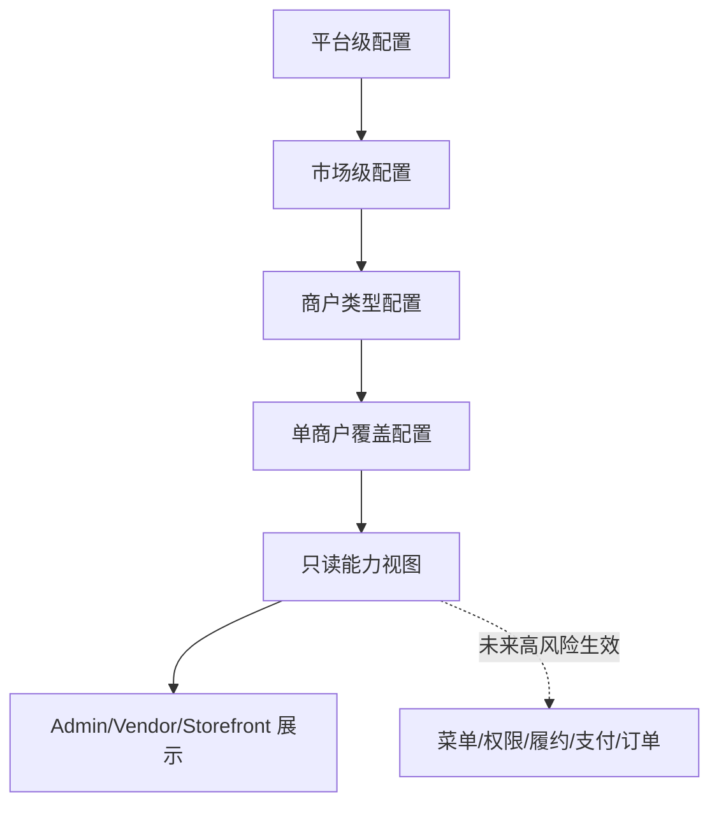

# Admin 模块开关配置合同设计

更新时间：2026-05-07 00:58 Asia/Shanghai

本文档设计 Admin 模块开关从当前只读 capability contract 演进到真实配置存储的后端合同。当前阶段只做设计，不写业务代码，不让任何开关真实生效。

## 当前状态

已存在：

- `GET /admin/china/capabilities`
  - Admin 登录态保护，未登录返回 401。
  - 返回平台、市场、商户、供应方、支付/结算等能力分组。
  - 只读展示，不写库，不改变权限或业务行为。

- Admin 模块开关页
  - 读取 capability contract。
  - 读取失败或未登录时回退本地只读 mock 提示。
  - 不提供真实保存。

当前缺口：

- 没有真实配置存储。
- 没有市场级和商户级覆盖关系。
- 没有操作审计。
- 没有配置版本和回滚。
- 没有模块开关到权限、菜单、履约、支付或订单的生效链路。

## 设计原则

- 配置视图和能力视图分离。
- 写配置和业务生效分离。
- 高风险模块必须串行，不进入普通并行 UI PR。
- 所有写接口必须具备权限、审计、幂等、回滚。
- 默认关闭真实生效，只先支持 read model 和 admin draft。

## 配置层级



优先级从低到高：

1. 平台默认值。
2. 市场覆盖。
3. 商户类型覆盖。
4. 单商户覆盖。
5. 紧急冻结/强制关闭。

第一阶段只生成能力视图，不进入 `Runtime`。

## 建议配置对象

### Module Definition

模块定义是代码或 seed 中的稳定字典，不应该由运营随意新增。

| 字段 | 说明 |
| --- | --- |
| `key` | 稳定 key，如 `pickup_card`、`live_stream`、`materials_market` |
| `label` | 中文名称 |
| `description` | 运营说明 |
| `risk_level` | low / medium / high |
| `owner` | platform / market / merchant / supplier / system |
| `runtime_scope` | display_only / menu / fulfillment / payment / settlement / permission |
| `default_status` | enabled / disabled / design_only |
| `requires_serial_pr` | 是否必须串行 |

### Module Config

真实配置存储，未来建表或 module。

| 字段 | 说明 |
| --- | --- |
| `id` | 配置 ID |
| `module_key` | 模块 key |
| `scope_type` | platform / market / merchant_type / seller |
| `scope_id` | 对应 ID，platform 可为空 |
| `status` | enabled / disabled / read_only / design_only |
| `effective_from` | 生效开始时间 |
| `effective_to` | 生效结束时间 |
| `reason` | 操作原因 |
| `version` | 乐观锁版本 |
| `metadata` | 扩展字段 |

### Module Config Audit

| 字段 | 说明 |
| --- | --- |
| `id` | 审计 ID |
| `config_id` | 配置 ID |
| `operator_id` | Admin 用户 ID |
| `operation` | create / update / pause / resume / rollback |
| `before` | 变更前 JSON |
| `after` | 变更后 JSON |
| `reason` | 操作原因 |
| `idempotency_key` | 幂等键 |
| `created_at` | 操作时间 |

## 模块风险分类

### 低风险，只读或 UI 展示

- 店铺装修入口。
- 直播占位入口。
- 提货卡入口展示。
- 市场公告展示。
- AI 草稿入口展示。
- 物料市场入口展示。

这些仍然不能直接写真实订单或履约。

### 中风险，影响菜单或工作台

- 商户类型菜单显隐。
- 物料供应商工作台。
- 配送供应商工作台。
- 上游供给方工作台。
- 快递打印 mock 工作台。

必须验证商户数据隔离和 role mapping。

### 高风险，必须串行

- 支付方式启停。
- 支付通知处理。
- 退款。
- 对账。
- 商家结算。
- payout。
- commission。
- permission/RBAC。
- checkout shipping option 生效。
- 真实发货/物流状态。

这些不能由通用模块开关直接生效，必须各自有 dedicated task。

## API 合同设计

### 只读能力视图

保留现有：

- `GET /admin/china/capabilities`
- `GET /store/china/capabilities`
- `GET /store/china/vendor-capabilities`

未来响应中增加：

```json
{
  "capabilities": {
    "mode": "read_only_contract",
    "source": "module_config_view",
    "effective_scope": {
      "market_id": "market_xxx",
      "seller_id": "sel_xxx",
      "merchant_type": "seafood_stall"
    },
    "groups": []
  }
}
```

### Admin 配置读取

未来设计：

- `GET /admin/china/module-configs`
- `GET /admin/china/module-configs/:id`
- `GET /admin/china/module-config-audits?module_key=&scope_type=&scope_id=`

第一阶段可以只读。

### Admin 配置写入

未来设计：

- `POST /admin/china/module-configs`
- `PATCH /admin/china/module-configs/:id`
- `POST /admin/china/module-configs/:id/rollback`

写接口要求：

- Admin 登录态。
- 权限检查。
- `Idempotency-Key`。
- 必填 `reason`。
- 乐观锁 `version`。
- 操作审计。
- 高风险 module 阻断，返回“必须走专用串行任务”。

## 生效策略

阶段 1：只读 contract

- 前端读取能力视图。
- Admin 只能看 mock/只读。
- 不改变 runtime 行为。

阶段 2：配置草稿

- Admin 可以创建 draft 配置。
- 仍不影响菜单、权限、履约或支付。
- 用于运营确认和 QA。

阶段 3：低风险展示生效

- 只允许 display-only 模块影响 UI 展示。
- 所有展示都必须有 fallback。

阶段 4：中风险菜单/工作台生效

- 商户类型和菜单显隐生效。
- 必须做权限和数据隔离验证。

阶段 5：高风险业务生效

- 支付、订单、履约、结算各自独立设计和 PR。
- 不通过通用开关直接切换。

## 回滚设计

- 每次变更生成 audit record。
- 配置支持版本号。
- 回滚 API 只能恢复上一版本配置，不直接改业务状态。
- 对已经产生业务副作用的高风险模块，不能使用通用回滚，必须走专项补偿流程。

## PR 拆分

1. Contract Design Doc
   - 仅文档。

2. Read Model Types
   - 新增类型和只读 view builder。
   - 不写库，不生效。

3. Admin Read UI
   - Admin 查看配置层级和审计 mock。
   - 不保存。

4. Config Storage Skeleton
   - migration/module/table。
   - 不接 runtime。

5. Draft Write API
   - 可写 draft，审计完整。
   - 不影响 runtime。

6. Display-only Runtime
   - 只允许低风险展示入口按配置显示。

7. High-risk Dedicated PRs
   - 支付/退款/结算/权限/配送分别串行。

## 验证计划

文档阶段：

```bash
git diff --check -- docs/admin-module-config-contract-design.md project-ledger .codex/queue.md
```

未来 API 阶段：

```bash
cd packages/api
../../node_modules/.bin/tsc --noEmit -p tsconfig.json
./node_modules/.bin/medusa build
curl -i http://127.0.0.1:9000/admin/china/capabilities
```

未来 Admin 阶段：

```bash
bun --cwd apps/admin run lint
bun --cwd apps/admin run build
```

## 当前结论

Admin 模块开关下一步不能直接做“保存并生效”。正确路线是先做配置合同、只读配置视图、审计模型和 draft 写入，再分阶段让低风险展示入口生效。任何影响支付、订单、退款、结算、佣金、权限或 checkout 配送的能力必须独立串行处理。
