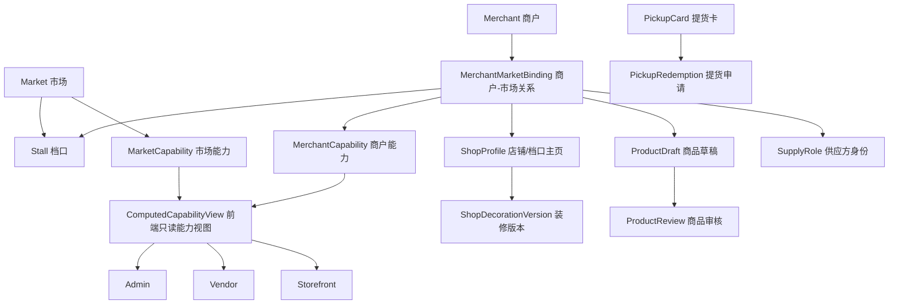

# 中国本地化后端数据契约地图

日期：2026-05-05

本文档把当前 Admin、Vendor、Storefront 的中国本地化 mock UI，映射成后续真实后端需要提供的数据对象、接口边界和安全禁区。本文只做设计，不创建 API、不写 migration、不改业务代码、不接真实 Provider。

## 总原则

- 前端 mock 字段不是后端事实来源。真实能力必须由后端模型、权限、审计和 Provider 边界共同决定。
- 市场、档口、商户类型、模块开关是第一批基础数据；商品、店铺装修、提货卡和供应链能力都依赖它们。
- 消费者前台、平台运营后台、商家后台可以展示同一个对象的不同视图，但不能各自发明互相冲突的状态。
- 支付、退款、对账、结算、佣金、权限仍是高风险串行区，不进入普通 UI 合同任务。
- 所有写操作都要有操作者、范围、原因、前后值、trace id 和时间戳。

## 总体关系

## 第一批基础对象

| 对象 | 用途 | 主要消费者 | 先决条件 |
| --- | --- | --- | --- |
| `Market` | 可切换市场、营业时间、公告和配送规则的归属 | Admin、Vendor、Storefront | 无 |
| `Stall` | 市场内档口、区域、摊位号和营业状态 | Admin、Vendor、Storefront | `Market` |
| `MerchantMarketBinding` | 商户属于哪个市场、哪个档口、什么商户类型 | Admin、Vendor | `Market`、`Merchant`、`Stall` |
| `ModuleCapability` | 平台可开放能力清单 | Admin | 无 |
| `ComputedCapabilityView` | 按市场、商户、角色计算后的只读能力 | Admin、Vendor、Storefront | `ModuleCapability`、权限 |
| `AuditLog` | 所有关键配置和状态变更的留痕 | Admin | 登录用户和 trace id |

### Market

建议字段：

- `id`
- `code`
- `name`
- `province`
- `city`
- `district`
- `address`
- `status`: `draft`、`active`、`paused`、`archived`
- `timezone`: 默认 `Asia/Shanghai`
- `business_hours`
- `announcements`
- `delivery_rule_summary`
- `created_at`、`updated_at`

接口边界：

- Admin 可创建、编辑、暂停市场，但必须写审计。
- Vendor 和 Storefront 只读当前可见市场。
- 市场暂停不能自动取消订单、退款或结算，只能影响后续入口和提示。

### Stall

建议字段：

- `id`
- `market_id`
- `stall_no`
- `zone`
- `floor`
- `display_name`
- `status`: `active`、`paused`、`vacant`、`closed`
- `delivery_modes_allowed`: `market_delivery`、`merchant_delivery`、`self_pickup`、`express`
- `created_at`、`updated_at`

接口边界：

- 档口号应在同一市场内唯一，或按市场规则配置唯一。
- 配送方式是档口/商户能力，不应写在单个商品主字段上；商品可以声明适用履约方式，但展示口径优先来自店铺/档口能力。

### MerchantMarketBinding

建议字段：

- `id`
- `merchant_id`
- `market_id`
- `stall_id`
- `stall_no`
- `merchant_type`: `seafood_stall`、`fruit_vegetable`、`materials_supplier`、`delivery_supplier`、`farmer`、`grower`、`seedling_supplier`、`regional_wholesaler`
- `status`: `pending_review`、`active`、`paused`、`rejected`、`closed`
- `credentials_status`
- `joined_at`
- `created_at`、`updated_at`

接口边界：

- 一个商户可以绑定多个市场。
- 商户类型决定 Vendor 菜单和可接单范围，但不能代替权限系统。
- 物料供应商、配送供应商、养殖户、种植户、种苗供应商、外地批发商属于 B 端能力，不进入消费者首页主链路。

## 能力开关合同

### ModuleCapability

建议能力 key：

- `storefront_market_switch`
- `shop_decoration`
- `mobile_quick_listing`
- `ai_listing_draft`
- `pickup_card_fulfillment`
- `materials_procurement`
- `materials_supplier_orders`
- `delivery_supplier_orders`
- `waybill_printing`
- `upstream_source_quotes`
- `seedling_wholesale`
- `regional_wholesaler_connection`
- `shop_live_status`

建议字段：

- `key`
- `name`
- `risk_level`: `low`、`medium`、`high`、`critical`
- `default_state`: `disabled`、`enabled`、`pilot`
- `requires_provider`
- `requires_audit`
- `description`

### ComputedCapabilityView

前端应读取这个只读结果，而不是自行判断开关。

建议字段：

- `actor_id`
- `actor_role`
- `market_id`
- `merchant_id`
- `visible_capabilities`
- `disabled_reasons`
- `computed_at`

接口边界：

- Admin 可以看到配置来源和禁用原因。
- Vendor 只看到自己可用能力和不可用提示。
- Storefront 只看到消费者可见能力，不暴露内部配置原因。

## Storefront 数据合同

| 页面/能力 | 后端对象 | 读写 | 关键边界 |
| --- | --- | --- | --- |
| 首页市场切换 | `Market`、`MarketAnnouncement` | 读 | 不展示 B 端物料采购主链路。 |
| 找店找货 | `ShopProfile`、`ProductSearchDocument` | 读 | 搜索结果需要区分店铺、商品、市场。 |
| 店铺/档口主页 | `ShopProfile`、`ShopDecorationVersion`、`Stall` | 读 | 自提/配送说明放在店铺/档口上下文。 |
| 商品详情 | `Product`、`ProductSpecTemplate`、`MerchantMarketBinding` | 读 | 规格来自后台模板，不由前端硬编码。 |
| 提货卡入口 | `PickupCardRedemptionIntent` | 写 | 不进入购物车支付、优惠券、满减、折扣、储值链路。 |
| 购物车/结算 | 现有 commerce contract | 读写 | 不因中国 UI 文案改支付、订单、退款逻辑。 |

## Vendor 数据合同

| 页面/能力 | 后端对象 | 读写 | 关键边界 |
| --- | --- | --- | --- |
| 商家首页 | `VendorDashboardSummary`、`ComputedCapabilityView` | 读 | 指标来自聚合 API，不由前端静态计算。 |
| 手机快速上架 | `VendorProductDraft` | 写 | 只能创建草稿，不直接上架。 |
| AI 草稿上架 | `VendorProductDraftSuggestion` | 写 | AI 输出必须商户确认，不能自动发布。 |
| 店铺装修 | `ShopProfile`、`ShopDecorationVersion` | 读写 | 发布要审核、可回滚、有审计。 |
| 物料供应商 | `MaterialSupplyProduct`、`MaterialOrder` | 读写 | B 端订单，不进入消费者商品流。 |
| 配送供应商 | `DeliveryService`、`DeliveryTask`、`WaybillPrintJob` | 读写 | 不直接改订单、退款、结算状态。 |
| 上游供给 | `SupplyQuote`、`PurchaseNeed`、`ArrivalPlan` | 读写 | 面向商户供需，不替代消费者前台商品。 |

## Admin 数据合同

| 页面/能力 | 后端对象 | 读写 | 关键边界 |
| --- | --- | --- | --- |
| 运营首页 | `AdminOperationSummary` | 读 | 聚合指标只读展示。 |
| 市场配置 | `Market`、`Stall`、`MarketDeliveryRule` | 读写 | 改配置必须审计，不自动改历史订单。 |
| 模块开关 | `ModuleCapability`、`MarketCapabilityOverride`、`MerchantCapabilityOverride` | 读写 | 前端隐藏不是权限控制。 |
| 商户管理 | `MerchantMarketBinding`、`MerchantCredential` | 读写 | 入驻审核、冻结、权限需要独立审计。 |
| 商品规格模板 | `ProductSpecTemplate` | 读写 | 模板版本化，不直接改已售商品事实。 |
| 提货卡管理 | `PickupCardBatch`、`PickupCard`、`PickupRedemption` | 读写 | 不展示明文卡密，不触发真实发货或退款。 |
| 支付与对账 | `PaymentEvent`、`ReconciliationRecord` | 读 | 只读为主；真实处理必须串行任务。 |
| 结算管理 | `SettlementRecord`、`PayoutRequest` | 读 | 不在 UI 壳里实现打款、佣金或提现。 |

## 提货卡合同

提货卡是线下实体卡，消费者通过卡号/卡密/二维码在线兑换指定商品或套餐并填写收货/提货信息。它不是优惠券、满减券、折扣券、储值卡或支付方式。

建议对象：

- `PickupCardBatch`
- `PickupCard`
- `PickupCardSecretDigest`
- `PickupRedemptionIntent`
- `PickupRedemptionOrder`
- `PickupFulfillmentRecord`
- `PickupCardAuditLog`

核心边界：

- 卡密只保存摘要或加密密文，后台不展示明文。
- 提货申请必须幂等，避免重复提货。
- 兑换结果不能以前端跳转为准。
- 后续生成提货订单、扣库存、配送发货都必须独立设计 workflow。

## 高风险串行区

以下对象和行为不能混入普通 UI 或 mock 任务：

- 支付成功确认、支付通知、退款、对账。
- 商家结算、提现、佣金、分账。
- 订单状态改写、履约状态改写。
- 权限、角色、RBAC、冻结、处罚。
- 真实短信、IM、物流、电子面单、直播推流、AI 自动发布。

真实接入前必须补齐：

- Provider 验签或鉴权。
- 幂等键。
- 可重试处理。
- 原始事件保存。
- 审计日志。
- 回滚和人工介入路径。

## 建议 PR 顺序

1. `china-contract-market-and-stall`：市场、档口、商户市场关系合同。
2. `china-contract-capability-view`：模块开关和只读能力视图合同。
3. `china-contract-product-draft`：手机快速上架和 AI 草稿合同。
4. `china-contract-shop-decoration`：店铺装修草稿、审核、发布合同。
5. `china-contract-storefront-read-model`：前台首页、店铺页、搜索、商品详情读模型。
6. `china-contract-pickup-card`：提货卡验证和提货申请合同。
7. `china-contract-b2b-supply`：物料、配送、上游、种苗、外地批发商 B 端合同。
8. 高风险串行：支付、退款、对账、结算、佣金、权限。

## 验证清单

后续每个合同 PR 至少验证：

- 是否明确读写方向。
- 是否写清 UI mock 不等于真实业务事实。
- 是否绕开支付、退款、结算、佣金、权限等高风险区。
- 是否包含审计、权限、幂等和回滚要求。
- 是否说明 Storefront、Admin、Vendor 各自读取哪个视图。
