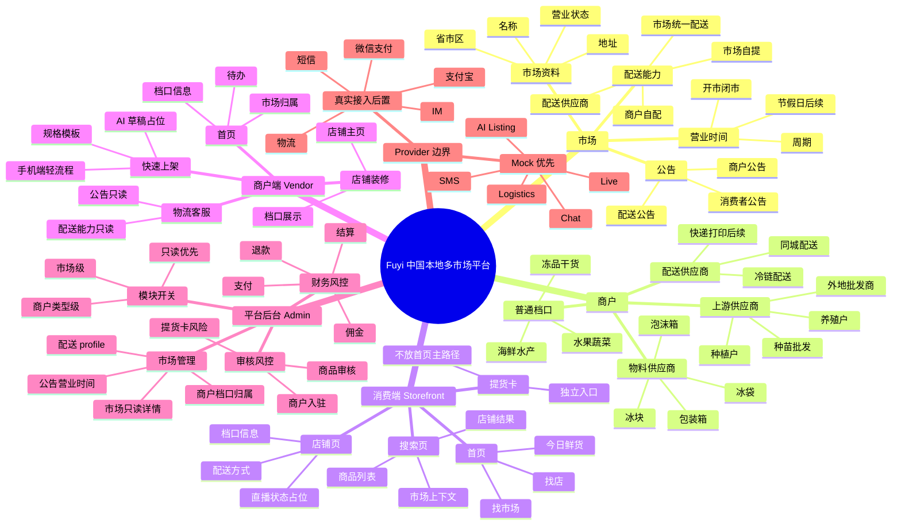
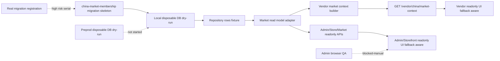

# China Market Platform Architecture Map

更新时间：2026-05-07 Asia/Shanghai

## 思维导图

## 当前数据链路

## 状态总览

| 区域                      | 当前状态                                  | 下一步                         |
| ------------------------- | ----------------------------------------- | ------------------------------ |
| Market membership schema  | migration skeleton + local dry-run passed | 预发 disposable DB checklist   |
| Repository adapter        | unit tests passed                         | 本地 DB integration test       |
| Vendor context route      | read-only route + DB QA passed            | 保持只读，后续做真实登录态 QA  |
| Admin market view         | readonly view exists                      | 登录态浏览器 QA                |
| Storefront market read    | readonly API/client 已有                  | DB QA 后再考虑 UI 真实数据替换 |
| Payment/refund/settlement | 未进入                                    | 高风险串行，不自动做           |
| Real providers            | mock-only skeleton                        | 真实接入后置                   |

## 核心原则

- 消费端先找市场、找店，再看商品。
- 配送方式属于市场和档口上下文，不应在商品卡上喧宾夺主。
- 物料/配送供应商是商户类型能力，不应放在消费者首页主路径。
- 提货卡是独立消费入口，不是优惠券、满减券、折扣券、储值卡或支付方式。
- AI 上架只能生成草稿建议，不能直接创建真实商品。
- 支付成功以后端异步通知为准，必须验签、幂等、可重试。
