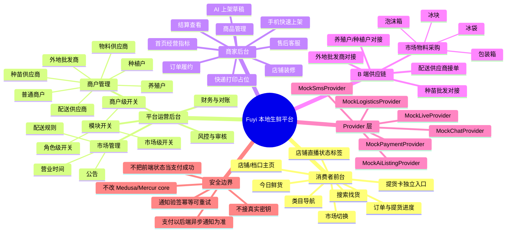
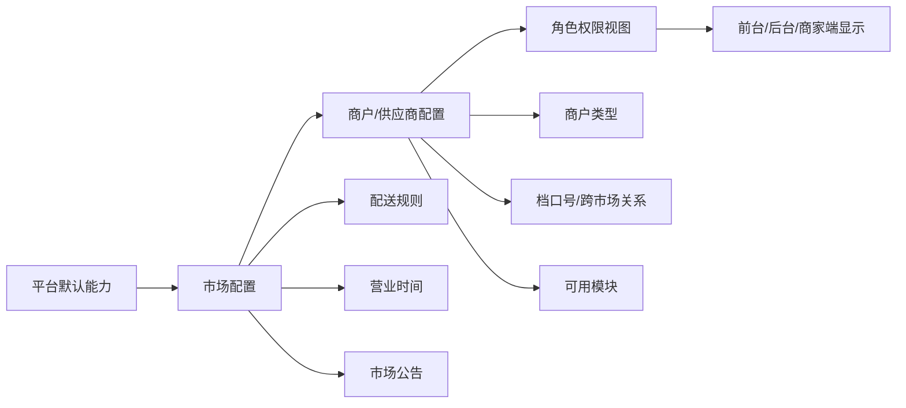
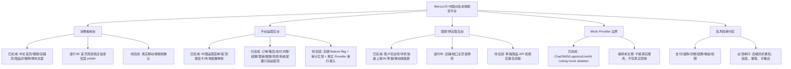
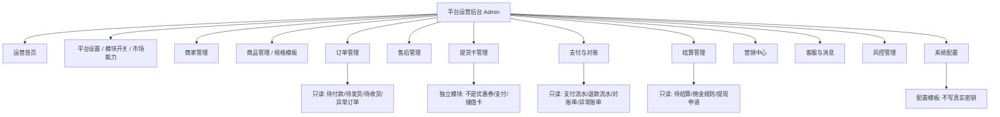
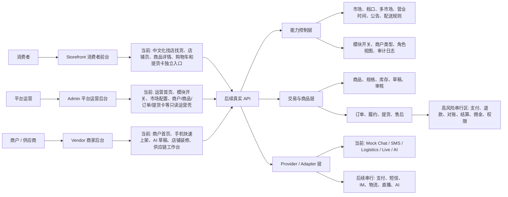
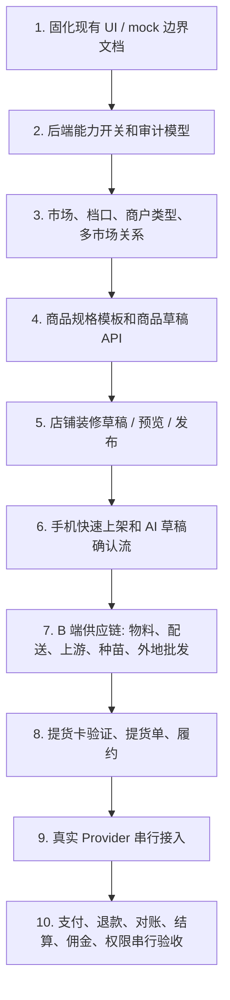

# 中国本地化平台架构图

本文档记录当前 MercurJS 中国大陆本地化方向，帮助主 agent 和并行 AG 在同一张图上工作。

## 总目标

把 MercurJS 改造成可切换市场的本地生鲜供应链与多商户经营平台。平台以市场、店铺/档口、角色工作台和模块开关为核心，先做 mock 与 UI 骨架，再逐步接入真实后端能力。

## 思维导图

## 核心边界

- 消费者首页不做物料采购主链路；物料采购属于商户端或供应链模块。
- 提货卡不是支付、优惠券、满减券、折扣券、储值卡或购物车抵扣；消费者通过独立入口提交提货申请。
- 直播不是首页主模块；只在店铺/档口卡上显示状态，后续由独立 Provider 和审核策略控制。
- AI 上架只能生成草稿，必须商户确认后才允许进入正式上架流程。
- 所有真实支付、退款、对账、结算、佣金、权限改造必须串行推进。

## 平台开关模型草案

第一阶段只做 UI、文档、mock 和 task 文件。后续接后端时，模块开关应由后端配置、审计日志和权限系统共同决定，不能只靠前端隐藏入口。

## 当前实现位置

- Admin 运营后台：`apps/admin`
- Vendor 商家后台：`apps/vendor`
- Storefront 消费者前台：`apps/storefront`
- Provider 边界文档：`docs/mock-service-providers.md`
- 提货卡架构：`docs/pickup-card-architecture.md`
- 后端数据契约地图：`docs/china-backend-data-contract-map.md`
- 任务队列：`.codex/queue.md`

## 当前推进图

## 第七轮并行分工

| AG | 任务 | 范围 | 状态 |
| --- | --- | --- | --- |
| Fermat | `storefront-home-market-density-polish` | `apps/storefront/**` | done |
| Galileo | `vendor-shop-decoration-shell` | `apps/vendor/**` | done |
| Averroes | `admin-module-open-control-polish` | `apps/admin/**` | done |

主 agent 负责汇总、验证、风险判断和队列状态更新；并行 AG 不 commit、不 push。

## Admin 模块覆盖图

Admin 当前只做运营视图和 mock 边界。任何真实审核、冻结、退款、打款、发券、发送消息、接入 Provider 或权限改造，都需要后续独立任务和后端审计设计。

## 端到端分层图

这张图的含义是：当前三个端都可以继续 polish UI 和 mock 数据，但真实 API 接入必须先经过能力控制层与 Provider/Adapter 边界。高风险串行区不能被普通 UI 任务顺手改掉。

## 当前可追溯矩阵

| 模块 | 当前用户价值 | 当前实现形态 | 后续真实能力入口 | 风险等级 |
| --- | --- | --- | --- | --- |
| 消费者首页 | 找市场、找店、找鲜货 | Storefront 中文 UI + mock 展示 | 市场/店铺/商品搜索 API | 中 |
| 店铺/档口主页 | 看商户、档口、今日鲜货、配送能力和直播状态 | Storefront 店铺页 mock | 店铺装修、商户资质、配送配置、直播状态 API | 中 |
| 提货卡消费者入口 | 持实体卡在线提货 | Storefront 独立入口 UI | 提货卡验证、提货单、履约 API | 高 |
| 平台运营首页 | 看平台指标、待办、风险 | Admin mock 看板 | 运营聚合 API 和审计日志 | 中 |
| 模块开关/市场配置 | 控制市场和商户开放哪些能力 | Admin 只读/占位壳 | 后端 feature flag、权限和审计 | 高 |
| 商户管理 | 管理普通商户、供应商、档口、多市场 | Admin 只读表格 | 商户类型、市场关系、档口模型 | 中 |
| 商品规格模板 | 统一规格和上架字段 | Admin 只读规格模板 | 类目规格模型、审核和版本管理 | 中 |
| 商家首页 | 商户日常经营工作台 | Vendor 单页 mock 壳 | 商户指标、待办、风险 API | 中 |
| 手机快速上架 | 移动端简单上今日鲜货 | Vendor UI 壳 | 商品草稿、图片、规格、库存、审核 API | 中 |
| AI 草稿上架 | 一句话生成上架草稿 | Vendor mock 草稿 | AI provider + 安全校验 + 人工确认 | 高 |
| 店铺装修 | 商家维护自己的主页 | Vendor 装修壳 | 装修草稿、预览、发布、审核、回滚 | 中 |
| 物料供应 | 面向商户采购泡沫箱、冰袋等 | Vendor B 端入口 | 物料商品、供应商接单、B 端订单 | 中 |
| 配送供应商 | 统一配送或第三方配送接单 | Vendor B 端入口 | 配送服务、轨迹、异常、电子面单 | 高 |
| 上游供给 | 养殖户、种植户、外地批发商对接商户 | Vendor B 端入口 | 供需、报价、到货计划、冷链 | 中 |
| 支付/退款/结算/佣金 | 真实交易资金流 | 仅 Admin 只读说明和安全边界 | 独立串行后端任务 | 极高 |

## 接真实能力建议顺序

建议先把第 2 到第 6 步做稳。支付、退款、结算和佣金等资金链路放在最后串行推进，避免 UI 阶段的 mock 误触真实交易状态。

## 需要继续补的架构件

- `Admin`：模块开关后端模型、市场配置 API、商户类型 API、审计日志。
- `Vendor`：商品草稿 API、AI 草稿确认流、店铺装修草稿/发布 API。
- `Storefront`：店铺页真实数据契约、搜索/类目 API、提货卡独立入口的数据契约。
- `Provider`：Mock 到真实 Provider 的注册策略、环境变量模板、错误码和回滚策略。
- `QA`：每轮都保留桌面端、移动端和登录态后台的视觉验收记录。

其中第一轮数据对象、读写方向和高风险禁区已经汇总在 `docs/china-backend-data-contract-map.md`，后续 API 设计优先从这份契约地图拆 PR。
