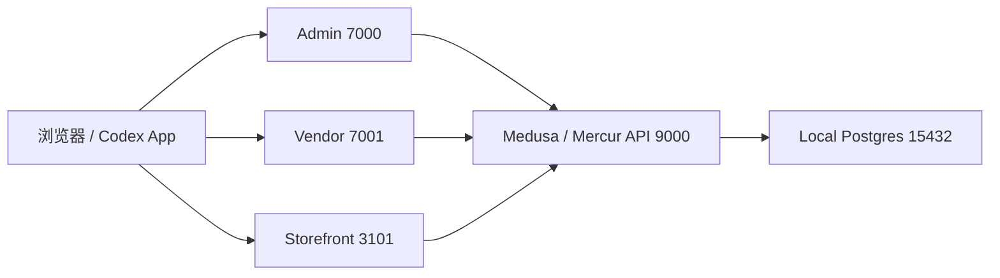

# 本地配置与上线边界审计

日期：2026-05-05

本文档用于把当前 `china/integration-localization` worktree 的本地开发配置、上线替换方式和风险边界固定下来。目标是避免“本地能跑的临时改动”在后续上线时变成不清楚来源的生产配置。

## 结论

- 当前本地开发依赖 WSL 内的统一启动脚本 `.codex/scripts/start-dev.sh`。
- 本地服务端口是固定开发端口：API `9000`、Admin `7000`、Vendor `7001`、Storefront `3101`、Postgres `15432`。
- Admin 本地登录问题与 cookie/session 主机名有关，后续必须保持前端访问地址和 API backend URL 主机名一致。
- Admin 后端地址已收束为环境变量优先：`VITE_MEDUSA_BACKEND_URL`，本地默认兜底为 `http://127.0.0.1:9000`。
- 生产环境不能使用 `localhost`、`127.0.0.1`、`supersecret`、`pk_mock_visual_qa` 或 mock provider 默认值。
- 当前大量 UI 页面仍是 mock/placeholder，这是低风险 UI 阶段可接受的，但 release 前必须通过 feature flag、权限和真实后端边界重新审计。

## 本地服务拓扑

## 本地运行配置

| 项 | 本地值 | 来源 | 上线处理 |
| --- | --- | --- | --- |
| API | `http://127.0.0.1:9000` | `.codex/scripts/start-dev.sh` | 替换为生产 API 域名 |
| Admin | `http://127.0.0.1:7000/dashboard` | `.codex/scripts/start-dev.sh` + Vite | 替换为生产 Admin 域名 |
| Vendor | `http://127.0.0.1:7001` | `.codex/scripts/start-dev.sh` | 替换为生产商户后台域名 |
| Storefront | `http://127.0.0.1:3101/cn` | `.codex/scripts/start-dev.sh` | 替换为生产买家端域名 |
| Postgres | `postgres://codex@127.0.0.1:15432/mercur` | `.codex/scripts/start-dev.sh` | 使用托管 PostgreSQL / 内网数据库连接 |
| Publishable key | 数据库读取；缺失时 `pk_mock_visual_qa` | `.codex/scripts/start-dev.sh` | 必须替换为真实 publishable key |
| 本地管理员 | local dev admin，仅本地数据库 | Medusa CLI 创建 | 生产必须使用正式账号邀请/SSO/RBAC 流程 |

## 环境变量边界

### API / Medusa

| 变量 | 当前用途 | 本地默认/现状 | 上线要求 |
| --- | --- | --- | --- |
| `CODEX_DATABASE_URL` | Codex 本地覆盖数据库连接 | `postgres://codex@127.0.0.1:15432/mercur` | 不用于生产 |
| `DATABASE_URL` | Medusa 数据库连接 | 本地 `.env` 指向 `127.0.0.1:15432` | 必须为生产数据库连接 |
| `STORE_CORS` | Storefront CORS | 包含本地 `localhost/127.0.0.1` | 必须替换为生产买家端域名 |
| `ADMIN_CORS` | Admin CORS | 包含本地 `7000/9000` | 必须替换为生产 Admin 域名 |
| `VENDOR_CORS` | Vendor CORS | 包含本地 `7001` | 必须替换为生产 Vendor 域名 |
| `AUTH_CORS` | Auth CORS | 包含本地 Admin/Vendor/API | 必须替换为生产登录来源域名 |
| `JWT_SECRET` | JWT 签名 | 本地存在；值已脱敏 | 生产必须用强随机 secret |
| `COOKIE_SECRET` | session cookie 签名 | 本地存在；值已脱敏 | 生产必须用强随机 secret |
| `REDIS_URL` | Redis / event / locking | 模板为 `redis://localhost:6379`；当前日志显示可能使用 fake redis | 生产必须配置真实 Redis 或明确替代方案 |
| `MERCUR_VENDOR_URL` | Vendor URL | 模板/本地指向 localhost | 生产必须为商户后台域名 |

### Admin

| 变量 | 当前用途 | 本地默认/现状 | 上线要求 |
| --- | --- | --- | --- |
| `VITE_MEDUSA_BACKEND_URL` | Admin dashboard 调用 API 的 base URL | 未设置时兜底 `http://127.0.0.1:9000` | 必须设置为生产 API 域名；不要依赖兜底 |

说明：Admin cookie/session 登录要求页面来源和 API backend URL 在浏览器 cookie 策略下可用。若生产 Admin 与 API 跨域，必须同步检查 CORS、`Access-Control-Allow-Credentials`、cookie `SameSite/Secure/Domain` 策略。

### Storefront

| 变量 | 当前用途 | 本地默认/现状 | 上线要求 |
| --- | --- | --- | --- |
| `MEDUSA_BACKEND_URL` | Storefront 服务端请求 API | 本地脚本设为 `http://127.0.0.1:9000` | 生产 API 内网/公网地址 |
| `NEXT_PUBLIC_BASE_URL` | SEO、canonical、metadata | 本地脚本设为 `http://127.0.0.1:3101` | 生产买家端域名 |
| `NEXT_PUBLIC_MEDUSA_PUBLISHABLE_KEY` | Store API publishable key | 本地缺失时 mock 兜底 | 生产真实 publishable key |
| `NEXT_PUBLIC_DEFAULT_REGION` | 默认国家/区域 | `cn` | 生产按实际 region 设置 |
| `NEXT_PUBLIC_STRIPE_KEY` | Stripe 前端 key | template 中是 placeholder | 中国本地支付阶段不要作为生产主支付来源 |
| `NEXT_PUBLIC_ALGOLIA_ID` / `NEXT_PUBLIC_ALGOLIA_SEARCH_KEY` | 搜索 | template/example 中存在 placeholder | 未接真实搜索前必须为空或禁用 |
| `NEXT_PUBLIC_TALKJS_APP_ID` | 聊天 | example 中为空 | 未接真实 IM 前必须为空或禁用 |
| `NEXT_PUBLIC_VENDOR_URL` | 商户入口 | template 指向本地 | 生产商户后台域名 |

## 当前需要特别标记的本地值

| 位置 | 值/模式 | 风险 | 处理 |
| --- | --- | --- | --- |
| `packages/api/medusa-config.ts` | `jwtSecret` / `cookieSecret` 有 `supersecret` 兜底 | 生产高风险 | 生产必须强制设置真实 secret；后续可增加启动校验 |
| `packages/api/.env.template` | `JWT_SECRET=supersecret`、`COOKIE_SECRET=supersecret` | 模板易误用 | 后续应改为 `<generate-strong-secret>` 说明 |
| `apps/storefront/.env.template` | `NEXT_PUBLIC_ALGOLIA_ID=supersecret` | public 变量不应出现 secret 字样 | 后续应改为空值或 placeholder |
| `apps/storefront/next.config.ts` | 允许 `hostname: "**"` 图片域名 | 安全边界偏宽 | 上线前收紧到真实 CDN/媒体域名 |
| `.codex/scripts/start-dev.sh` | `pk_mock_visual_qa` | 仅本地视觉 QA | 禁止进入生产 |
| WIP UI 页面 | 大量 `mock` 文案/静态数据 | 容易被误认为真实功能 | release 前必须用 feature flag 和真实 API 边界审计 |

## 当前 WIP 分层建议

| 层级 | 内容 | 可否继续并行 | 上线前要求 |
| --- | --- | --- | --- |
| 低风险 UI | Admin/Vendor/Storefront 中文化、布局、mock 页面 | 可以 | 明确 mock，不触发真实状态变更 |
| 配置层 | CORS、backend URL、dev server、WSL 访问 | 可以，但需主 agent 统一管理 | 必须环境变量化、文档化 |
| Provider skeleton | mock SMS/IM/Logistics/AI/Live | 可以 | 不能接真实服务，不能写真实凭证 |
| 高风险业务 | 支付、退款、对账、结算、订单状态、权限 | 不建议并行 | 串行 PR、专项测试、幂等和审计 |

## 上线前检查清单

- 检查所有 `.env*`：不得保留本地数据库、localhost、127.0.0.1、`supersecret`、mock key。
- 检查 `packages/api/medusa-config.ts`：生产必须显式提供 `DATABASE_URL`、`JWT_SECRET`、`COOKIE_SECRET`、CORS。
- 检查 Admin：生产必须设置 `VITE_MEDUSA_BACKEND_URL`。
- 检查 Storefront：生产必须设置 `MEDUSA_BACKEND_URL`、`NEXT_PUBLIC_BASE_URL`、`NEXT_PUBLIC_MEDUSA_PUBLISHABLE_KEY`。
- 检查 CORS/Auth：Admin、Vendor、Storefront 域名必须进入对应 CORS 白名单。
- 检查 cookie/session：跨域部署时确认 `SameSite`、`Secure`、`Domain` 策略。
- 检查 mock provider：没有真实服务前必须默认关闭，UI 只显示占位说明。
- 检查 feature flag：模块开关不能只靠前端隐藏，后续必须接后端配置和权限。
- 检查图片域名：`next.config.ts` 的宽泛远程图片域名必须收紧。
- 检查本地管理员：本地账号不得迁移到生产。

## 回滚方式

- 本地服务异常：运行 `.codex/scripts/start-dev.sh status` 查看状态，再运行 `.codex/scripts/start-dev.sh start` 恢复。
- Admin 登录异常：确认浏览器使用 `http://127.0.0.1:7000`，且 `VITE_MEDUSA_BACKEND_URL` 指向 `http://127.0.0.1:9000` 或同源策略可用的 API。
- 配置误改：优先恢复环境变量，不改业务代码；必要时用 `git diff` 精确查看配置文件差异。
- 生产发布前：以本文档的上线前检查清单为 release gate。

## 本轮未做

- 未修改支付、订单、退款、结算、佣金、权限逻辑。
- 未接入真实微信支付、支付宝、短信、IM、物流、直播、快递打印。
- 未新增依赖。
- 未提交、未推送、未创建 PR。
