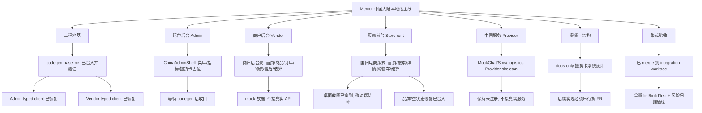

# China Localization Integration Readiness Report

日期：2026-05-03

本报告是主 agent 对各 worktree 的集成收口状态汇总。目标是避免“各分支单独能跑，合起来不通”。

## 总体结论

已完成真实 integration merge，当前集成分支为：

- Worktree: `/home/codex/code/fuyi-integration-cn`
- Branch: `china/integration-localization`
- 最新 HEAD: `706b0da Merge`

已按以下顺序合并：

1. `chore/codegen-baseline`
2. `china/vendor-i18n-zhcn-baseline`
3. `china/pickup-card-architecture`
4. `china/admin-i18n-zhcn-baseline`
5. `china/mock-service-providers`
6. `china/storefront-scaffold`

集成过程中已做 1 个主 agent 修复提交：

- `9324c56 fix vendor use generated API route types`

该修复删除了 vendor 分支里的临时 `apps/vendor/src/types/acme-api-generated.d.ts` shim，避免遮蔽 `packages/api` 提供的真实 `@acme/api/_generated` 类型。

后续已合入 Storefront 视觉修复：

- `af8abe5 fix(storefront): polish China homepage branding and empty state`
- Integration merge: `706b0da`

该修复将首页顶部品牌从旧 `FLEEK`/logo 残留调整为 `NEXT_PUBLIC_SITE_NAME`，fallback 为 `Fuyi`；同时过滤不完整商品数据，并在热门商品为空时显示中文空状态。

## 集成后验证结果

验证日期：2026-05-03

说明：integration worktree 未安装独立 `node_modules`。为遵守“不安装依赖”，验证时临时映射到主目录已有依赖，且每次验证后清理临时 `node_modules`、`dist`、`.next` 产物。

已通过：

- `bun --no-install run lint`
- `cd apps/admin && bun --no-install run build`
- `cd apps/vendor && bun --no-install run build`
- `cd apps/storefront && bun --no-install run build`
- `cd packages/api && npm run test:unit`，5 tests passed
- `node ./node_modules/typescript/bin/tsc --noEmit -p packages/api/tsconfig.json`
- `git diff --check`

最新补充验证：`af8abe5` / `706b0da` 合入后已再次跑完上述 lint/build/test/tsc/diff-check。结果仍通过。

重点集成检查：

- `apps/vendor/src/types/acme-api-generated.d.ts` 不存在，vendor 不再使用本地 generated type shim。
- `apps/admin/src/lib/client.ts` 和 `apps/vendor/src/lib/client.ts` 均导入 `@acme/api/_generated` 的 `Routes`。
- `china-service-providers` 未注册到 `medusa-config.ts`、API routes、workflows、subscribers、jobs 或 links。
- 未发现真实微信支付、支付宝、短信、IM、物流服务或真实密钥接入。
- Storefront 品牌/空状态修复合入后，已补跑 `cd apps/storefront && bun --no-install run lint` 和 `cd apps/storefront && bun --no-install run build`，通过；仍只有既有 React Hook dependency warnings。

仍需注意：

- Storefront build/lint 通过，但仍有既有 React Hook dependency warnings：`CartDropdown`、`PasswordValidator`、`ShippingAddress`、`CartAddressSection`。
- Admin build 通过，但仍有既有 bundle chunk size warning。
- Storefront 国内版式仍需要补移动端视觉验收。2026-05-03 已尝试启动本地 Next dev + 临时 mock Medusa regions/products/categories API；WSL 内部 `http://127.0.0.1:3100/cn` 可返回 200，HTML 中确认存在 `首页 | Fuyi`、`发现好物`、`放心下单`、`立即选购`、`商家入驻`、`热门商品`、`按类目逛` 等国内化信号。复用现有依赖并改用 `next dev -H 0.0.0.0 -p 3101` 后，Windows Edge headless 曾成功捕获真实桌面截图 `C:\Users\99592\AppData\Local\Temp\fuyi-integration-cn-home-1440.png`。该截图暴露的 `FLEEK` 品牌残留和热门商品空/不完整数据视觉问题，已由 `af8abe5` 修复并合入 integration。移动端截图仍未稳定取得，Codex in-app browser Node runtime 仍报 access denied，Windows 到 WSL dev server 的 `127.0.0.1` / WSL IP 通道仍偶发拒绝、502 或超时。后续操作见 `docs/storefront-visual-qa-runbook.md`。
- 当前集成分支未 push。
- 当前 worktree 仍有未跟踪的主 agent 汇总文档和 agent notes，尚未纳入 commit。

## 主控架构图



## Worktree 状态

| Worktree | Branch | 状态 | 当前判断 |
| --- | --- | --- | --- |
| `/home/codex/code/fuyi-codegen-cn` | `chore/codegen-baseline` | 已合入 integration | 作为 typed client 地基 |
| `/home/codex/code/fuyi-vendor-cn` | `china/vendor-i18n-zhcn-baseline` | 已合入 integration | 本地 shim 已在 integration 删除 |
| `/home/codex/code/fuyi-pickup-card-architecture-cn` | `china/pickup-card-architecture` | 已合入 integration | docs-only，低风险 |
| `/home/codex/code/fuyi-admin-cn` | `china/admin-i18n-zhcn-baseline` | 已合入 integration | typed client 已恢复 |
| `/home/codex/code/fuyi-service-provider-cn` | `china/mock-service-providers` | 已合入 integration | mock provider 未注册运行时 |
| `/home/codex/code/fuyi-storefront-scaffold-cn` | `china/storefront-scaffold` | 已合入 integration，含 `af8abe5` | build/lint 通过，移动端视觉待补 |
| `/home/codex/code/fuyi-integration-cn` | `china/integration-localization` | 集成验收 worktree | 已完成本轮合并和验证，未 push |

## 已集成提交

| Area | Commit / merge | 当前状态 |
| --- | --- | --- |
| Codegen baseline | `f335a01` | 已合入，提供 `@acme/api/_generated` |
| Vendor shell | `9af0ebf` | 已合入；vendor 本地 type shim 已由 `9324c56` 删除 |
| Pickup card architecture | `1ab33c1` | 已合入，docs-only |
| Admin shell | `9f397a5` | 已合入，typed client 正常 |
| Mock service providers | `ddc2ea4` | 已合入，保持未注册 |
| Storefront zh-CN baseline | `18c773f` | 已合入 |
| Storefront branding/empty-state fix | `af8abe5` / `706b0da` | 已合入并验证 |

## 复跑验证命令

```bash
bun run lint
cd apps/admin && bun run build
cd ../vendor && bun run build
cd ../storefront && bun run build
cd ../../packages/api && npm run test:unit
cd ../..
node ./node_modules/typescript/bin/tsc --noEmit -p packages/api/tsconfig.json
git diff --check
```

补充检查：

```bash
grep -R -n "china-service-providers" packages/api/medusa-config.ts packages/api/src/api packages/api/src/workflows packages/api/src/subscribers packages/api/src/jobs packages/api/src/links || true
grep -R -n "sk_live\\|pk_live\\|app_secret\\|private_key\\|merchant_id" . || true
```

## 主控待办

- 决定是否重命名 `chore/codegen-baseline` 为 `china/codegen-baseline`。
- 决定 `.codex/**` 任务入口是否每个分支单独提交，还是只保留在 main/integration。
- 补 Storefront 移动端真实截图验收。
- 决定 integration 主控文档是否提交到 `china/integration-localization`。
- 决定是否 push integration 分支或继续本地验收。
