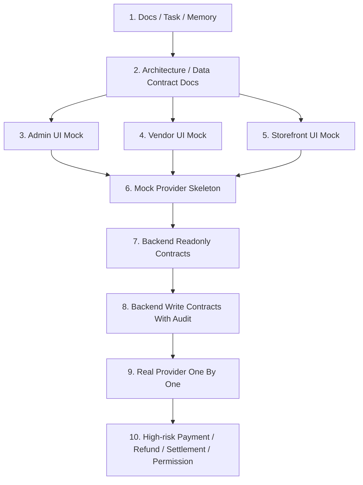

# Integration Review And Split Plan

日期：2026-05-04

本文是 `china/integration-localization` worktree 的主 agent 集成评审。目标是把当前中国本地化改动拆成可审计、可回滚、可继续并行推进的任务和 PR。本文只做文档规划，不修改业务代码。

具体文件归属见 `docs/integration-pr-file-manifest.md`。后续准备提交时，以该 manifest 按 PR A-H 选择文件，不要直接 `git add .`。

## 当前状态

当前 integration worktree 已包含多轮本地化工作：

- 项目记忆和任务队列：`AGENTS.md`、`.codex/memory.md`、`.codex/queue.md`、`.codex/tasks/**`
- Admin：中国平台运营后台壳、菜单、运营首页、提货卡、市场配置、模块开关和运营控制台
- Vendor：中国商户后台壳、手机快速上架、AI 草稿、店铺装修、物料/配送/上游/直播/快递打印占位
- Storefront：爱采购式本地鲜货首页、搜索页、店铺/档口页、提货卡入口、地址 UI、商品详情、购物车/结算文案
- Provider：Mock Chat/SMS/Logistics/Live/AI Listing provider skeleton，保持未注册运行时
- Docs：提货卡、Provider 边界、市场配置、feature flag API、AI 草稿 API、平台架构和进度板

## 当前验证基线

最近一次主 agent 验证结果：

- `git diff --check`：通过
- Admin build：通过，有 Vite chunk size warning
- Vendor build：通过
- Storefront build：通过，有既有 React hook dependency warning
- API typecheck：通过，`bunx tsc --noEmit --project packages/api/tsconfig.json`
- Mock provider unit test：通过，8/8
- Dev server 连通性：
  - Admin `http://127.0.0.1:7000/dashboard`：200
  - Vendor `http://127.0.0.1:7001/`：200
  - Storefront `http://127.0.0.1:3101/cn`：已重启后 200
  - Mock API `http://127.0.0.1:3901/store/regions`：200

剩余 warning：

- Admin 构建包体积较大，Vite chunk size warning。
- Storefront 仍有既有 React hook dependency warning，主要在 `CartDropdown`、`PasswordValidator`、`ShippingAddress`、`CartAddressSection`。
- Storefront dev 偶发 Next `.next/static/development/_buildManifest.js.tmp.*` ENOENT，需要重启 dev server；build 本身通过。

## 推荐 PR 拆分

拆分原则：

- 先合 docs / task / memory，再合 UI mock，再合未注册 Provider skeleton，最后才进入后端合同和高风险业务能力。
- 每个 PR 都要能单独 build 或至少单独 `diff-check`，不能靠“整包 WIP”掩盖问题。
- UI mock PR 只能展示状态，不能写真实业务事实。
- 后端 API 合同 PR 先只做设计或只读原型，真实写操作必须另开 PR。
- 支付、退款、对账、结算、佣金、权限一律从本批拆分里排除，进入串行高风险队列。

### PR A: Codex Workflow And China Planning Docs

范围：

- `AGENTS.md`
- `.codex/memory.md`
- `.codex/queue.md`
- `.codex/tasks/**`
- `docs/china-platform-architecture-map.md`
- `docs/china-localization-progress-board.md`
- `docs/china-localization-task-list.md`

说明：

- 固化自动队列、任务文件执行规则和中国本地化工作边界。
- 不包含应用 UI 或后端代码。

验证：

- `git diff --check -- AGENTS.md .codex docs`
- 人工确认文档内无真实密钥、无高风险业务指令。

风险：

- 低。主要风险是任务队列状态与实际代码状态不同步。

### PR B: Architecture And Backend Contract Docs

范围：

- `docs/china-platform-architecture-map.md`
- `docs/china-backend-data-contract-map.md`
- `docs/admin-china-page-coverage.md`
- `docs/vendor-china-page-coverage.md`
- `docs/admin-market-settings-backend-design.md`
- `docs/admin-feature-flag-api-design.md`
- `docs/vendor-draft-product-api-design.md`
- `docs/vendor-shop-decoration-api-design.md`
- `docs/pickup-card-architecture.md`
- `docs/mock-service-providers.md`

说明：

- 把当前 mock UI、页面覆盖、后端数据契约、Provider 边界和提货卡架构先固化。
- 这批不包含 `apps/**` 或 `packages/**` 业务代码。

验证：

- 文档尾随空白检查。
- 人工确认没有真实密钥、没有“前端状态即业务事实”的描述。
- 人工确认提货卡仍被定义为实体卡提货权益，不是优惠券、折扣、储值或支付方式。

风险：

- 低。主要风险是文档先于代码，需要后续实现 PR 回链更新。

### PR C: Admin China Operations Shell

范围：

- `apps/admin/src/components/ChinaAdmin*.tsx`
- `apps/admin/src/components/PickupCardDashboard.tsx`
- `apps/admin/src/i18n/**`
- `apps/admin/src/lib/china-admin-*.ts`
- `apps/admin/src/routes/**`
- `apps/admin/vite.config.ts`

说明：

- 平台运营后台中文壳、市场运营、模块开关、提货卡 mock、运营控制台。
- 仍是 UI/mock，不接真实后端开关，不改权限逻辑。

验证：

- `cd apps/admin && bun run build`
- 手动访问 `http://127.0.0.1:7000/dashboard` 和 `/dashboard/cn`
- 检查是否还有 `chinaAdmin.*` 未翻译 key。

风险：

- 中。菜单和后台入口容易靠近权限敏感区；真实接入前必须由后端权限和审计控制。

拆分建议：

- `C1 Admin 基础壳与菜单`：Shell、Sidebar、菜单、i18n hook。
- `C2 Admin 运营首页与运营控制台`：首页、模块开关、市场能力只读壳。
- `C3 Admin 只读表格数据拆分`：各业务域 mock 表格文件。
- `C4 Admin 提货卡与规格模板页面`：提货卡看板、细分页、商品规格模板。

如果 review 压力大，优先按 C1-C4 拆成多个 PR，而不是合成一个巨大 Admin PR。

### PR D: Vendor China Merchant Shell

范围：

- `apps/vendor/src/App.tsx`
- `apps/vendor/src/styles.css`
- `apps/vendor/src/china/**`

说明：

- 中国商户后台壳、角色入口、手机快速上架、AI 草稿、店铺装修、物料/配送/上游/直播/快递打印占位。
- 不接真实订单、发货、退款、结算、物流、AI 服务。

验证：

- `cd apps/vendor && bun run build`
- 手动访问 `http://127.0.0.1:7001/`
- 移动宽度检查快速上架和 AI 草稿页面不溢出。

风险：

- 中。当前文件体积较大，后续应拆组件，避免 `App.tsx` 长期变成单文件工作台。

拆分建议：

- `D1 Vendor 首页与菜单能力`：商户首页、市场选择、商户类型、模块入口。
- `D2 Vendor 上架能力壳`：手机快速上架、AI 草稿，仍不创建真实商品。
- `D3 Vendor 店铺装修壳`：店铺主页装修草稿展示。
- `D4 Vendor B 端供应链壳`：物料、配送、上游、种苗、外地批发商。

### PR E: Storefront Market Discovery Baseline

范围：

- `apps/storefront/src/app/[locale]/(main)/page.tsx`
- `apps/storefront/src/app/[locale]/(main)/search/**`
- `apps/storefront/src/app/[locale]/(main)/sellers/[handle]/**`
- `apps/storefront/src/app/[locale]/(main)/pickup-card/**`
- `apps/storefront/public/images/local-market/**`

说明：

- 爱采购式本地鲜货首页、搜索结果、店铺/档口主页、独立提货卡入口。
- 消费者首页不展示商户物料采购主链路。

验证：

- `cd apps/storefront && bun run build`
- 手动访问 `/cn`、`/cn/search?q=梭子蟹`、`/cn/sellers/a-hai-xian-huo-dang`、`/cn/pickup-card`

风险：

- 中。视觉满意度需要用户确认；当前数据多为 mock，需要后续接 Store API 或静态 mock 边界。

拆分建议：

- `E1 Storefront 首页和搜索`：首页、搜索、类目入口。
- `E2 Storefront 店铺/档口页`：店铺主页、自提/配送能力、直播状态标签。
- `E3 Storefront 提货卡独立入口`：保持独立页面，不进首页主模块。

### PR F: Storefront Checkout And Detail Localization

范围：

- Storefront 地址相关组件
- 商品详情相关组件
- 购物车、配送、支付、核对订单文案组件
- 优惠码文案

说明：

- 中国地址 UI、商品详情今日价/履约提示、购物车/结算中文文案和支付异步通知提示。
- 不改 `setAddresses`、`setShippingMethod`、`initiatePaymentSession`、`placeOrder`。
- 明确提货卡不是优惠券、余额或支付方式。

验证：

- `cd apps/storefront && bun run build`
- 手动检查账户地址、结算地址、商品详情、购物车、结算四步。

风险：

- 中。地址 UI 当前复用 Medusa 标准字段，区县/街道暂存 `company`，后续真实地址模型需要单独设计。

### PR G: Mock China Service Providers

范围：

- `packages/api/src/modules/china-service-providers/**`
- `docs/mock-service-providers.md`

说明：

- Mock Chat/SMS/Logistics/Live/AI Listing provider skeleton。
- 未注册到 `medusa-config.ts`，不会影响运行时业务逻辑。

验证：

- `bunx tsc --noEmit --project packages/api/tsconfig.json`
- `cd packages/api && bun test src/modules/china-service-providers/__tests__/mock-service-providers.unit.spec.ts`

风险：

- 低到中。当前为 skeleton，后续接真实服务必须拆高风险 Provider PR。

### PR H: API Config Template And Seed Safety

范围：

- `packages/api/.env.template`
- `packages/api/medusa-config.ts`
- `packages/api/src/scripts/seed.ts`

说明：

- 只允许保留 mock/provider 配置占位、环境变量模板和 seed 的中国本地化安全占位。
- 不注册真实 Provider，不写真实密钥，不改变支付、订单、退款、结算、佣金、权限逻辑。

验证：

- `bunx tsc --noEmit --project packages/api/tsconfig.json`
- 检查没有真实密钥、merchant id、private key、access key、app secret。
- 检查 `china-service-providers` 如未到运行时接入阶段，应保持未注册或 mock-only。

风险：

- 中。虽然是配置模板，但容易误接真实服务；必须严格 review。

## 上线迁移顺序

上线前建议只把 1-6 作为第一阶段可合并目标。第 7 步以后开始进入真实后端合同，必须有迁移、权限、审计、回滚和灰度方案。

## 合并门槛

| 批次 | 必须验证 | 不允许混入 |
| --- | --- | --- |
| Docs / Task | 文档尾随空白、人工风险检查 | `apps/**`、`packages/**` 业务代码 |
| Admin UI | `bun --cwd apps/admin lint`、`bun --cwd apps/admin build`、登录态手动看页面 | 订单/支付/退款/结算/权限写逻辑 |
| Vendor UI | `bun --cwd apps/vendor lint`、`bun --cwd apps/vendor build`、移动端快速上架检查 | 真实上架、真实订单、真实发货、真实结算 |
| Storefront UI | `bun --cwd apps/storefront lint`、`bun --cwd apps/storefront build`、桌面/移动视觉检查 | checkout/payment/order 行为改动 |
| Mock Provider | API typecheck、mock provider unit test | 真实短信、IM、物流、直播、AI、支付接入 |
| Backend Contract | API typecheck、权限/审计设计检查 | 绕过权限、无审计写操作、无幂等写操作 |

## 回滚策略

- 文档 PR 可直接 revert，不影响运行时。
- UI mock PR 应按端独立 revert：Admin、Vendor、Storefront 不互相绑定。
- Provider skeleton 如保持未注册，运行时风险低；一旦注册到 `medusa-config.ts`，必须有环境开关和回滚说明。
- 后端写操作 PR 必须提供 migration rollback 或向前兼容策略，不能只靠删代码回滚。
- 高风险资金链路 PR 必须提供人工对账和事件重放策略。

## 必须串行的高风险区

以下任务不能并行乱做，也不能混入 UI PR：

- 真实微信支付、支付宝、支付回调、支付状态
- 退款、售后退款状态、原路退回
- 对账、账单、商家结算、payout、commission
- 订单状态、发货状态、库存扣减、真实物流单
- 权限、RBAC、商户订单归属、后台写操作权限
- 真实短信、IM、直播、物流、快递打印 Provider

## 当前需要视觉确认的点

- Admin 是否符合用户给的国内平台运营后台参考图。
- Vendor 是否符合商户后台长期使用场景，尤其移动快速上架。
- Storefront 首页是否足够接近爱采购式找货/找店，但又保留本地生鲜海鲜平台气质。
- 提货卡入口是否应继续保持独立，不进入首页主模块。
- 直播是否只保留店铺状态标签，不进入首页主模块。

## 下一轮建议

1. `visual-qa-admin-vendor-storefront`：先做 HTTP 连通性和视觉 QA 清单，确认页面可看。
2. `storefront-category-and-product-list-polish`：补 Storefront 分类页和商品列表页，减少从首页点到默认通用商城的割裂感。
3. `admin-vendor-component-split-plan`：如果视觉方向确认，把 Admin/Vendor 大文件拆组件，降低后续维护风险。
4. `backend-feature-flag-readonly-api`：只读 API 原型，仍不接高风险写操作。

## 当前结论

当前 integration worktree 的低风险 UI/mock/docs 主线基本能通，适合先做视觉 QA，再拆 PR。暂时不要直接 commit 一大包；建议先按 PR A-G 主题拆分、逐个验证、逐个让用户看效果。
