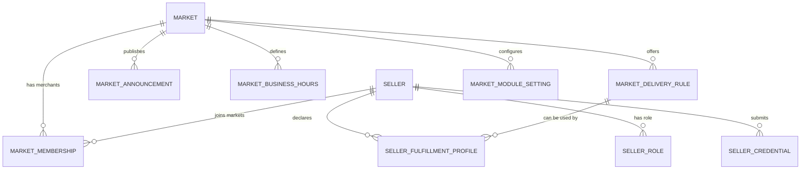

# 多市场与商户角色后端模型设计

更新时间：2026-05-07 00:45 Asia/Shanghai

本文档设计中国大陆本地生鲜/海鲜多商户平台的市场模型。当前阶段只做设计，不写业务代码，不改变支付、订单、退款、结算、佣金、权限或配送履约逻辑。

## 目标

平台需要从“单个示例市场 + demo seller metadata”演进到可配置、可审计、可切换的多市场模型：

- 消费者可以按市场、店铺/档口、鲜货类目发现商品。
- 商户可以属于一个或多个市场，并在不同市场有不同档口号、营业状态和配送能力。
- 平台可以管理市场营业时间、公告、配送规则、服务范围和模块开关。
- 物料供应商、配送供应商、养殖户、种植户、种苗供应商、外地批发商不能被简单混成普通商品商户。

## 非目标

- 不落真实数据库 migration。
- 不新增 API route。
- 不接真实物流、短信、IM、支付服务。
- 不改变 checkout shipping options。
- 不改变订单、支付、退款、结算、佣金、payout、permission、RBAC。
- 不把 seed 或 metadata 作为生产级市场配置来源。

## 当前状态

当前 integration worktree 已具备第一层只读链路：

- `seller.metadata` 中已有 demo 市场、档口、主营类目、资质、公告和履约方式。
- `/store/china/discovery` 返回只读发现数据，店铺来自 `seller` 表，类目来自 `product_category` 表，市场仍是静态配置契约。
- `/store/china/sellers/:handle/products` 返回 seller metadata 和当前档口 product ids。
- Admin/Vendor 已读取只读 capability contract，但这些能力还不是真实权限或配置。

这说明前台和后台已经有“读市场语义”的入口，但还没有真正的市场模型。

## 概念关系



核心关系：

- `Market` 是市场主体，如“三门海鲜市场”“舟山沈家门市场”。
- `Seller` 是 Mercur 现有商户主体。
- `MarketMembership` 表示一个商户在某个市场的经营关系，包含档口号、市场内状态、经营类目和营业时间覆盖。
- `SellerRole` 表示商户或供应方角色，普通商品商户、物料供应商、配送供应商、上游供给方需要分开。
- `MarketDeliveryRule` 表示市场统一配送、冷链、自提、配送供应商协作等规则，但第一阶段不能直接改变 checkout。

## 建议模块

### 1. Market Module

未来独立模块，管理市场基础资料。

建议字段：

| 字段 | 说明 | 第一阶段 |
| --- | --- | --- |
| `id` | 市场 ID | 未来真实表 |
| `name` | 市场名称 | 可先在 metadata/static contract |
| `slug` | 前台 URL 标识 | 未来真实表 |
| `city` | 城市 | 可先 metadata |
| `district` | 区县 | 可先 metadata |
| `address` | 详细地址 | 可先 metadata |
| `service_area` | 服务范围 | 未来真实配置 |
| `status` | draft/open/paused/closed | 未来真实表 |
| `timezone` | 默认 Asia/Shanghai | 固定默认 |
| `metadata` | 运营扩展字段 | 可先用 |

### 2. Market Membership

表达商户属于哪个市场、档口号以及跨市场经营。

建议字段：

| 字段 | 说明 | 第一阶段 |
| --- | --- | --- |
| `market_id` | 市场 ID | 未来真实 link |
| `seller_id` | Mercur seller ID | 未来真实 link |
| `booth_no` | 档口号，如 A区18号 | 当前可放 seller metadata |
| `stall_name` | 市场内档口名 | 当前可放 metadata |
| `status` | pending/open/paused/closed | 未来真实审核 |
| `main_categories` | 主营类目 | 当前可放 metadata |
| `is_primary` | 默认展示市场 | 未来真实表 |
| `operating_hours_override` | 商户在该市场营业时间覆盖 | 未来真实表 |

一个商户跨多个市场时，前台店铺页应显示当前市场上下文，后台商户页应能切换市场身份。

### 3. Seller Role

角色不能只靠一个文本字段混用。

建议角色：

| Role Key | 中文 | 面向对象 | 是否消费者购物主链路 |
| --- | --- | --- | --- |
| `seafood_stall` | 海鲜档口 | 消费者 + 商户 | 是 |
| `frozen_goods` | 冻品商户 | 消费者 + 商户 | 是 |
| `dry_goods` | 干货商户 | 消费者 + 商户 | 是 |
| `fruit_vegetable` | 水果蔬菜商户 | 消费者 + 商户 | 是，可由模块开关控制 |
| `materials_supplier` | 物料供应商 | 商户 | 否 |
| `delivery_supplier` | 配送供应商 | 平台/商户 | 否 |
| `farmer` | 养殖户 | 商户采购 | 否 |
| `grower` | 种植户 | 商户采购 | 否 |
| `seedling_supplier` | 种苗供应商 | 养殖户/种植户/商户 | 否 |
| `regional_wholesaler` | 外地批发商 | 商户采购 | 否 |

第一阶段可通过 capability contract 和 UI 展示角色边界，不能据此改变真实权限。

### 4. Market Business Hours

市场营业时间和商户营业时间需要分层。

市场层：

- 默认营业时间。
- 节假日特殊时间。
- 临时休市。
- 公告展示。

商户层：

- 是否跟随市场营业时间。
- 是否配置自己的营业时间。
- 是否暂停接单或暂停展示。

第一阶段：只读展示，不控制商品可买性或 checkout。

### 5. Market Announcement

公告用于消费者、商户、配送供应商不同端。

建议字段：

- `market_id`
- `audience`: consumer / merchant / delivery_supplier / all
- `title`
- `content`
- `severity`: info / warning / urgent
- `starts_at`
- `ends_at`
- `status`

第一阶段可作为静态/metadata 展示；真实发布需要 Admin 审计。

### 6. Market Delivery Rule

配送规则必须和 checkout shipping options 分阶段对接。

建议类型：

- `market_pickup`: 市场自提。
- `merchant_self_delivery`: 商家自行配送。
- `market_unified_delivery`: 市场统一配送。
- `third_party_delivery_supplier`: 配送供应商配送。
- `cold_chain_express`: 冷链快递。

第一阶段规则：

- 可在 Storefront / Seller page 展示。
- 可在 Admin/Vendor 作为只读或 mock 配置。
- 不改变真实 shipping options。

未来接入 checkout 前必须增加：

- 规则命中计算。
- 地址服务范围判断。
- 运费计算。
- 幂等和回滚。
- 配送供应商失败降级。
- 与现有 Medusa fulfillment/shipping option 的映射。

## 第一阶段可用 metadata

可以暂存在 `seller.metadata`：

- `market_name`
- `market_slug`
- `booth_no`
- `category_summary`
- `fulfillment_methods`
- `announcement`
- `credentials`
- `live_status`

不能长期只靠 metadata：

- 跨市场 membership。
- 市场营业时间和休市。
- 配送服务范围和运费。
- 模块开关真实生效。
- 商户角色和权限绑定。
- 审核状态、审计日志、操作人。

原因：这些字段会影响可见性、履约、权限或交易，必须具备结构化查询、审计、回滚和权限控制。

## API 演进建议

### 第一层，只读

已存在或建议延续：

- `GET /store/china/discovery`
- `GET /store/china/sellers/:handle/products`
- `GET /store/china/capabilities`
- `GET /store/china/vendor-capabilities`
- `GET /admin/china/capabilities`

新增设计，不落代码：

- `GET /store/china/markets`
- `GET /store/china/markets/:slug`
- `GET /store/china/markets/:slug/sellers`
- `GET /admin/china/markets`
- `GET /admin/china/markets/:id`

### 第二层，Admin 配置草稿

仅在权限和审计设计完成后：

- `POST /admin/china/markets`
- `PATCH /admin/china/markets/:id`
- `POST /admin/china/markets/:id/announcements`
- `POST /admin/china/market-memberships`
- `PATCH /admin/china/market-memberships/:id`

所有写接口都必须包含：

- Admin 登录态。
- 权限检查。
- 操作日志。
- 幂等键或重复提交保护。
- 字段级校验。
- 回滚策略。

### 第三层，业务生效

暂不实现。未来影响：

- Storefront 市场筛选和排序。
- 商品可见性。
- 商户工作台菜单。
- checkout 配送选项。
- 订单履约。

这层必须单独 PR，不能和 UI/document PR 混合。

## PR 拆分

1. Market Model Design Doc
   - 仅文档。
   - 验证：`git diff --check`。

2. Market Read Model Skeleton
   - 新增只读类型/contract。
   - 不写库，不接真实 checkout。
   - 验证：API tsc/build，Store API smoke。

3. Market Admin Read UI
   - Admin 市场列表/详情只读 mock 或 contract。
   - 不提供真实保存。
   - 验证：Admin lint/build。

4. Market Membership Metadata Bridge
   - 从 seller metadata 过渡到 read model。
   - 不改变权限和商品可见性。
   - 验证：seed、API build、Storefront smoke。

5. Market Config Storage
   - 真实模块/表/migration。
   - 必须包含权限、审计、回滚。
   - 中高风险，串行。

6. Fulfillment Rule Integration
   - 将配送规则安全接到 shipping options。
   - 高风险，必须串行。

## 验证计划

文档阶段：

```bash
git diff --check -- docs/market-model-backend-design.md project-ledger .codex/queue.md
```

只读 API 阶段：

```bash
cd packages/api
../../node_modules/.bin/tsc --noEmit -p tsconfig.json
./node_modules/.bin/medusa build
curl -H "x-publishable-api-key: <local-pk>" http://127.0.0.1:9000/store/china/discovery
```

UI 阶段：

```bash
bun --cwd apps/admin run lint
bun --cwd apps/admin run build
bun --cwd apps/storefront run build
```

## 风险点

- 市场模型一旦影响商品可见性，会触碰商品搜索、库存和商家归属。
- 配送规则一旦影响 checkout，会触碰 fulfillment 和 order flow。
- 商户角色一旦影响菜单或 API 权限，会触碰 RBAC/permission。
- 跨市场商户会影响数据隔离和运营统计。
- 物料/配送/上游供应商不能进入消费者购物主链路，否则会混淆交易模型。

## 当前建议

下一步先做 `admin-module-config-contract-design` 和 `vendor-fulfillment-config-design`，继续保持文档设计层，等三份设计对齐后再考虑只读 API skeleton。
