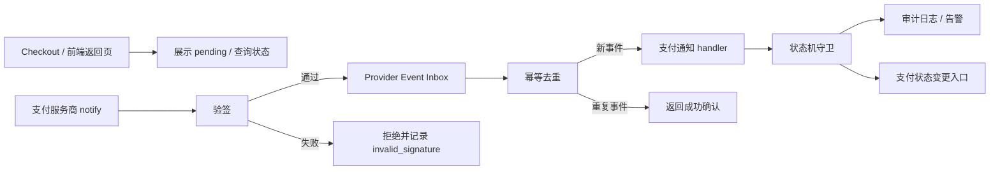

# 支付通知幂等框架计划

## 目标

本文档为后续中国本地支付接入建立支付通知验签、幂等、重试和审计的统一计划。当前阶段只做架构和任务拆分，不实现真实支付 Provider，不修改订单、支付、退款、结算、佣金或权限逻辑。

核心原则：

- 支付成功必须以后端异步通知为准。
- 前端 return URL 只能展示结果或 pending 状态，不能作为支付成功来源。
- 通知必须先验签，再进入业务处理。
- 同一 provider event 重复到达必须幂等。
- 通知处理必须可重试，并保留足够审计信息。

## 非目标

- 不接入真实支付宝。
- 不接入真实微信支付。
- 不写真实密钥、商户号、证书或 webhook token。
- 不实现真实退款、对账、商家结算、佣金或权限规则。
- 不改变 checkout、cart、order、payment、refund、payout、commission 或 permission 运行时行为。
- 不注册生产 migration。
- 不连接预发或生产数据库。

## 系统边界



说明：

- `Checkout / 前端返回页` 不直接写支付成功状态。
- `Verify` 必须在任何业务处理之前执行。
- `Provider Event Inbox` 用于保存 provider 原始通知、验签结果、幂等 key、处理状态和错误。
- `PaymentState` 只能通过受控入口变更，不能由页面跳转、客户端 query 或未验签 payload 直接驱动。

## Provider Notification Contract

每个支付 Provider 后续都要实现同一类通知合同：

| 字段 | 说明 |
| --- | --- |
| `provider` | `mock_china_pay`、`alipay`、`wechat_pay` 等 provider id |
| `event_id` | provider 原始事件 id；如果 provider 无稳定事件 id，使用 provider transaction id + event type + event time 派生 |
| `event_type` | 支付成功、支付关闭、退款成功、退款失败等标准化事件 |
| `provider_transaction_id` | 服务商交易号 |
| `merchant_order_ref` | 平台侧订单或 payment session 关联引用 |
| `amount` | provider 通知金额，必须和平台预期金额校验 |
| `currency` | 默认 `CNY`，仍需显式校验 |
| `occurred_at` | provider 事件时间 |
| `received_at` | 平台接收时间 |
| `raw_payload` | 原始 payload，敏感字段脱敏或加密存储 |
| `signature_status` | `verified`、`invalid`、`missing`、`unsupported` |
| `idempotency_key` | 标准幂等 key |
| `processing_status` | `received`、`verified`、`processing`、`processed`、`retryable_failed`、`terminal_failed`、`ignored_duplicate` |

## 验签规则

验签模块必须由 Provider Adapter 提供，平台只依赖统一接口：

```text
verifyNotification(provider, headers, rawBody, config) -> VerificationResult
```

基本规则：

- 必须使用 raw body 验签，不能用已经被 JSON parser 改写过的 body 代替。
- 验签失败不得进入 payment state mutation。
- 验签失败要记录 provider、headers 摘要、payload 摘要、失败原因和接收时间。
- 真实密钥只能来自环境配置或密钥管理系统，不能写入仓库。
- Mock provider 也要模拟签名流程，避免后续真实 provider 接入时重写边界。

## 幂等规则

推荐幂等 key：

```text
payment_notify:{provider}:{event_id}
```

当 provider 无稳定 `event_id` 时，派生规则：

```text
payment_notify:{provider}:{provider_transaction_id}:{event_type}:{amount}:{occurred_at}
```

处理规则：

- 首次收到事件时写入 inbox，并标记 `received`。
- 验签通过后标记 `verified`。
- 处理开始前通过唯一约束或事务锁占有该 `idempotency_key`。
- 已处理成功的重复事件直接返回 provider 期望的 ack，不重复变更 payment/order。
- 正在处理的重复事件返回安全 ack 或短暂 retry，具体按 provider 要求定义。
- 可重试失败事件只能在记录重试次数后重新进入处理。

## 状态机守卫

通知 handler 不应直接散落修改 payment/order 状态。后续实现要先设计一个状态机守卫层：

```text
ProviderEvent -> NormalizedPaymentEvent -> PaymentStateCommand -> Existing Medusa/Mercur payment workflow
```

守卫层必须检查：

- provider 是否匹配当前 payment session。
- 金额和币种是否匹配。
- payment session / order 当前状态是否允许该事件推进。
- 事件是否过期或乱序。
- 是否存在退款、关闭、部分支付等冲突状态。

本计划不定义具体 Medusa payment workflow 改动；真实接入前必须单独评审。

## 异常处理

| 场景 | 处理 |
| --- | --- |
| 验签失败 | 拒绝处理，记录 `invalid_signature`，不改状态 |
| 重复通知 | 返回成功 ack，不重复变更状态 |
| 金额不一致 | 标记 `terminal_failed` 或 `manual_review`，不改成功状态 |
| 币种不是 CNY | 标记异常，不改状态 |
| 找不到订单或 payment session | 记录 `unknown_reference`，进入人工排查或可重试队列 |
| 通知乱序 | 保存事件，按状态机判断 ignore、retry 或人工处理 |
| provider 超时重试 | 幂等命中后返回 provider 要求的 ack |
| 平台内部异常 | 标记 `retryable_failed`，由后台任务重试 |

## 观测与审计

后续实现至少要暴露这些运维字段：

- provider id
- event id
- provider transaction id
- merchant order ref
- idempotency key
- signature status
- processing status
- retry count
- last error code
- first received at
- last processed at
- operator/manual review status

日志注意：

- 不输出完整密钥、证书、卡号、手机号或真实卡密。
- 原始 payload 如需保存，必须考虑脱敏、加密、保留周期和权限。
- Admin UI 只能展示必要摘要，不能泄露密钥或敏感 payload。

## PR 拆分

建议后续串行拆分：

1. `payment-notification-contract-docs`
   - 继续完善 provider notification contract 和状态机守卫文档。
   - 不写运行时代码。

2. `mock-payment-notification-skeleton`
   - 新增未注册 mock provider notification skeleton。
   - 只做签名校验 mock、payload normalize 和单元测试。
   - 不改变 payment/order 状态。

3. `payment-notification-inbox-model-design`
   - 设计 inbox / event log migration。
   - 先做本地 disposable DB dry-run。
   - 不注册生产 migration。

4. `payment-notification-idempotency-test-harness`
   - 用 fake signed payload 验证重复通知、验签失败、金额不一致、unknown reference。
   - 不连接真实 provider。

5. `mock-payment-notification-runtime`
   - 在明确任务中接入 mock-only runtime。
   - 默认 disabled。
   - 不接真实支付宝或微信支付。

6. `alipay-provider-plan`
   - 真实支付宝 provider 的配置、验签、通知、退款和对账拆分计划。
   - 不与微信支付、退款、结算混在一个 PR。

7. `wechat-pay-provider-plan`
   - 真实微信支付 provider 的配置、验签、通知、退款和对账拆分计划。
   - 不与支付宝、退款、结算混在一个 PR。

8. `refund-reconciliation-settlement-series`
   - 退款、对账、商家结算、佣金和权限必须独立串行评审。

## 验收清单

当前 docs-only 任务验收：

- 只修改文档、任务文件和 ledger。
- `git diff --check` 通过。
- staged 文件不包含 `apps/**`、`packages/**`、`bun.lock`、`package.json`、`.env`。
- 文档明确支付成功以后端异步通知为准。
- 文档明确验签、幂等、可重试和审计边界。
- 文档明确真实 Provider、退款、对账、结算、佣金和权限仍是高风险串行任务。

后续实现任务验收：

- 必须有单元测试覆盖重复通知、验签失败、金额不一致和未知订单。
- 必须有本地 disposable DB dry-run 或等价迁移演练。
- 必须有 rollback 或 feature flag 方案。
- 必须能证明前端 return URL 不会写支付成功状态。
