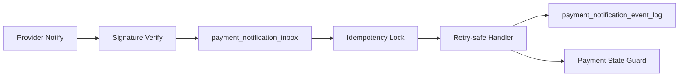

# 支付通知 Inbox 模型设计

## 目标

本文档设计中国本地支付通知后续需要的 inbox / event log 数据模型。当前阶段只做模型设计和 dry-run 计划，不新增 migration，不连接数据库，不改变任何交易运行时行为。

## 为什么需要 Inbox

支付宝、微信支付和未来 Mock provider 都会重复发送通知，也可能出现超时、乱序、验签失败、金额不一致或订单引用缺失。直接在 webhook handler 中修改支付/订单状态会带来重复处理和审计困难。

因此后续应先把 provider 通知写入 inbox，再由幂等和状态机守卫处理：



## 表 1: payment_notification_inbox

职责：

- 保存 provider 通知的唯一处理记录。
- 承载幂等唯一约束。
- 记录验签结果、处理状态、重试次数和最近错误。
- 不直接代表 payment/order 最终状态。

建议字段：

| 字段 | 类型建议 | 说明 |
| --- | --- | --- |
| `id` | text / uuid | 平台内部 id |
| `provider` | text | `mock_china_pay`、`alipay`、`wechat_pay` |
| `event_id` | text | provider 事件 id，可为空但不推荐 |
| `event_type` | text | normalized event type |
| `idempotency_key` | text | 全局唯一 |
| `merchant_order_ref` | text | 平台侧订单或 payment session 引用 |
| `payment_session_id` | text nullable | 可后续解析 |
| `provider_transaction_id` | text nullable | provider 交易号 |
| `provider_refund_id` | text nullable | provider 退款号 |
| `amount_value` | integer | 最小货币单位 |
| `currency` | text | 当前应为 `CNY` |
| `signature_status` | text | `verified`、`invalid`、`missing`、`unsupported` |
| `raw_payload_digest` | text | 原始 payload hash |
| `raw_payload_ref` | text nullable | 受控存储引用 |
| `processing_status` | text | `received`、`verified`、`processing`、`processed`、`retryable_failed`、`terminal_failed`、`ignored_duplicate` |
| `retry_count` | integer | 默认 0 |
| `last_error_code` | text nullable | 最近错误码 |
| `last_error_message` | text nullable | 脱敏错误摘要 |
| `occurred_at` | timestamptz nullable | provider 事件时间 |
| `received_at` | timestamptz | 平台接收时间 |
| `processed_at` | timestamptz nullable | 处理完成时间 |
| `created_at` | timestamptz | 创建时间 |
| `updated_at` | timestamptz | 更新时间 |

唯一约束：

```text
unique(provider, idempotency_key)
```

可选索引：

- `(provider, event_id)`
- `(merchant_order_ref)`
- `(payment_session_id)`
- `(processing_status, received_at)`
- `(provider_transaction_id)`

## 表 2: payment_notification_event_log

职责：

- 记录 inbox 状态变化和 handler 决策。
- 支持人工排查、重试和审计。
- 不直接作为业务状态表。

建议字段：

| 字段 | 类型建议 | 说明 |
| --- | --- | --- |
| `id` | text / uuid | 日志 id |
| `inbox_id` | text | 关联 inbox |
| `action` | text | `received`、`verified`、`dedupe_hit`、`handler_started`、`processed`、`retry_scheduled`、`failed` |
| `actor_type` | text | `system`、`provider`、`operator` |
| `message` | text | 脱敏说明 |
| `metadata` | jsonb | 脱敏辅助信息 |
| `created_at` | timestamptz | 发生时间 |

索引：

- `(inbox_id, created_at)`
- `(action, created_at)`

## 状态流转

建议状态：

```text
received -> verified -> processing -> processed
received -> invalid_signature -> terminal_failed
processing -> retryable_failed -> processing
processing -> terminal_failed
processed -> ignored_duplicate
```

规则：

- `signature_status != verified` 时不得进入 payment state guard。
- `processed` 的重复通知只记录 `dedupe_hit`，不重复推进状态。
- `retryable_failed` 必须限制最大重试次数。
- `terminal_failed` 需要能进入人工排查，不自动重试。

## 与支付/订单状态隔离

Inbox 只是消息收件箱，不是支付状态事实表。后续 handler 即使实现，也必须通过受控状态机入口调用现有 Medusa/Mercur payment workflow。

禁止：

- migration 创建时顺带修改 payment/order schema。
- inbox insert 后直接标记订单已支付。
- 前端 return URL 直接写 inbox 为成功。
- provider payload 未验签即调用状态推进。

## Dry-run 计划

真正 migration skeleton 前，先做本地 disposable DB dry-run：

1. 创建临时数据库。
2. 执行 up SQL。
3. 验证表存在。
4. 验证唯一约束拒绝重复 `(provider, idempotency_key)`。
5. 插入 `verified`、`invalid`、`retryable_failed` fixture。
6. 验证查询索引覆盖常用排查路径。
7. 执行 down SQL。
8. 验证表被删除。
9. 删除临时数据库并复查无残留。

预发 dry-run 仍必须等待可丢弃目标库、备份和回滚确认。

## PR 拆分

1. `payment-notification-inbox-migration-skeleton`
   - 只新增 migration skeleton 和本地 disposable dry-run 脚本。
   - 不注册生产 migration。

2. `payment-notification-inbox-repository`
   - 新增 repository interface 和内存/SQL 测试。
   - 不接 webhook runtime。

3. `payment-notification-idempotency-test-harness`
   - 使用 fake signed payload 验证 duplicate、invalid signature、amount mismatch、unknown reference。

4. `mock-payment-notification-runtime-disabled`
   - 默认 disabled。
   - 只允许 mock provider。

5. `real-provider-notify-serial`
   - 支付宝、微信支付分别单独串行。

退款、对账、结算、佣金和权限继续独立串行，不混入支付通知 inbox PR。

## 验收

当前文档任务验收：

- 只修改 docs、task 和 ledger。
- `git diff --check` 通过。
- staged 文件不包含 `apps/**`、`packages/**`、`bun.lock`、`package.json` 或 `.env`。
- 明确 inbox 不改变支付/订单状态。
- 明确 up/down dry-run 和预发阻塞条件。
