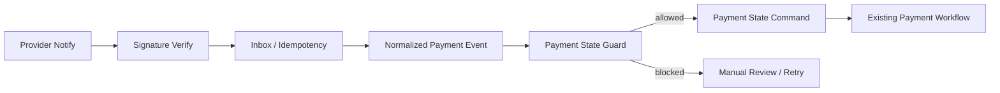

# 支付通知状态机守卫计划

## 目标

本文档规划未来支付通知 handler 在进入 Medusa/Mercur payment workflow 前必须经过的状态机守卫。当前只做设计，不写运行时代码，不调用真实 payment workflow。

## 背景

当前已经具备：

- Mock payment notification envelope。
- Mock signature verifier。
- Idempotency key。
- Inbox / event log migration skeleton。
- In-memory inbox repository。
- 本地 disposable DB dry-run 和 harness。

下一步如果直接把通知接到 payment/order 状态，会进入高风险区。因此必须先定义守卫层。

## 守卫位置



守卫层只决定“是否允许生成状态推进 command”，不直接修改 payment/order。

## Guard 输入

```text
PaymentNotificationEnvelope
InboxRecord
CurrentPaymentSessionSnapshot
CurrentOrderSnapshot
ProviderConfigSnapshot
```

Snapshot 要求：

- 只读。
- 必须带时间戳。
- 不允许在 guard 中写数据库。
- 读取失败应返回 `manual_review` 或 `retryable_failed`，不能默认成功。

## Guard 输出

```text
allowed:
  command_type: capture_payment | close_payment | mark_failed | no_op
  reason
  audit_metadata

blocked:
  block_type: invalid_signature | duplicate | amount_mismatch | currency_mismatch | provider_mismatch | state_conflict | unknown_reference | out_of_order | manual_review
  retryable
  reason
  audit_metadata
```

## 必须校验

| 校验 | 规则 |
| --- | --- |
| 验签状态 | 只有 `verified` 能进入 guard allowed 路径 |
| 幂等状态 | 已 processed 的重复通知只能 no-op / ack |
| Provider | 通知 provider 必须匹配 payment session provider |
| 金额 | 通知金额必须等于平台待支付金额 |
| 币种 | 当前只允许 CNY |
| Payment session | 必须存在且处于可推进状态 |
| Order | 必须存在或能安全关联，不存在时进入 unknown reference |
| 事件顺序 | 已关闭/已失败/已退款路径不能被支付成功乱序覆盖 |
| 风险标记 | `amount_mismatch`、`weak_idempotency_source` 等必须阻断自动成功 |

## 典型场景

### 支付成功

允许条件：

- signature verified。
- inbox 首次处理或未 processed。
- provider 匹配。
- amount / currency 匹配。
- payment session 处于待支付或可 capture 状态。
- order 未处于取消、关闭、退款中等冲突状态。

输出：

```text
capture_payment
```

但仍只能由后续 workflow 层执行。

### 重复通知

条件：

- idempotency key 已 processed。

输出：

```text
no_op
```

行为：

- 记录 `dedupe_hit`。
- 返回 provider 期望 ack。
- 不重复调用 payment workflow。

### 金额不一致

输出：

```text
blocked: amount_mismatch
retryable: false
```

行为：

- 不改支付状态。
- 进入人工排查。

### 未知订单引用

输出：

```text
blocked: unknown_reference
retryable: true
```

行为：

- 初期可以重试，超过阈值后人工排查。
- 不默认创建订单或 payment session。

### 前端 return URL 先到

行为：

- 页面展示“支付结果确认中”。
- 不写成功状态。
- 等待后端 notify 或安全查询。

## 后续 PR 拆分

1. `payment-notification-state-guard-contract`
   - 只新增 guard 类型和纯函数测试。
   - 不调用 payment workflow。

2. `payment-notification-state-guard-fixtures`
   - 新增 current snapshot fixture。
   - 覆盖 amount mismatch、provider mismatch、duplicate、unknown reference。

3. `mock-payment-notification-handler-disabled`
   - 默认 disabled。
   - 只串 mock envelope -> inbox -> guard。
   - 不执行 payment workflow。

4. `payment-workflow-command-adapter-plan`
   - 文档评审如何映射到现有 Medusa/Mercur payment workflow。
   - 真实状态推进必须单独高风险审批。

5. `real-provider-runtime-serial`
   - 支付宝和微信支付分开。
   - 退款、对账、结算、佣金、权限分开。

## 验收

当前文档任务验收：

- 只修改 docs、task 和 ledger。
- `git diff --check` 通过。
- 不修改 `apps/**` 或 `packages/**`。
- 明确 guard 不直接写 payment/order。
- 明确前端 return URL 不能写成功状态。
