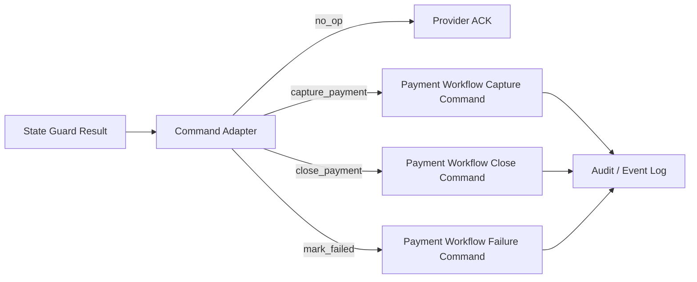

# 支付 Workflow Command Adapter 计划

## 目标

本文档规划未来支付通知 state guard 输出如何映射到 Medusa/Mercur payment workflow command adapter。当前只做设计，不实现 adapter，不调用任何 payment workflow。

## 当前前置成果

已经具备：

- `ChinaPaymentNotificationEnvelope`
- mock signature verifier
- idempotency key
- inbox / event log migration skeleton
- in-memory inbox repository
- `guardPaymentNotificationState` 纯函数
- 本地 idempotency harness

这些都仍然未注册 runtime，不会改变交易状态。

## Adapter 位置



Adapter 只负责把 guard 的 allowed command 转为未来 workflow command DTO。真正执行 workflow 必须是后续独立高风险 PR。

## 输入

```text
PaymentNotificationStateGuardResult
PaymentNotificationInboxRecord
PaymentNotificationEnvelope
CurrentPaymentSessionSnapshot
CurrentOrderSnapshot
```

要求：

- 输入必须来自已验签、已入 inbox、已通过 guard 的数据。
- Snapshot 必须是只读数据。
- Adapter 不允许重新信任前端 return URL。
- Adapter 不允许读取真实密钥或 provider 配置明文。

## 输出

建议输出 DTO：

```text
PaymentWorkflowCommand =
  | { type: "no_op"; reason; auditMetadata }
  | { type: "capture_payment"; paymentSessionId; orderId; amount; idempotencyKey; auditMetadata }
  | { type: "close_payment"; paymentSessionId; orderId; idempotencyKey; auditMetadata }
  | { type: "mark_failed"; paymentSessionId; orderId; errorCode; idempotencyKey; auditMetadata }
```

输出只是 DTO，不执行状态变更。

## 映射规则

| Guard command | Adapter 输出 | 当前阶段 |
| --- | --- | --- |
| `no_op` | `no_op` | 可做纯函数测试 |
| `capture_payment` | `capture_payment` DTO | 只规划，不执行 |
| `close_payment` | `close_payment` DTO | 只规划，不执行 |
| `mark_failed` | `mark_failed` DTO | 只规划，不执行 |

Blocked result：

- 不生成 workflow command。
- 生成 audit-only decision。
- 根据 `retryable` 判断是否进入 retry queue 或人工排查。

## 幂等规则

Adapter 输出必须带：

- provider
- event id
- idempotency key
- inbox id
- payment session id
- order id

未来执行层必须用这些字段保证：

- 同一 `idempotency_key` 不重复执行 capture。
- workflow 失败后可重试。
- 重试不改变原始 provider event。

## 审计规则

每个 adapter decision 都要写入 event log：

- `command_prepared`
- `command_skipped`
- `command_blocked`
- `workflow_execution_started`
- `workflow_execution_succeeded`
- `workflow_execution_failed`

当前 migration skeleton 的 action 白名单还没有这些值；后续如果要实现 adapter，需要先单独 PR 扩展 event log action，不能偷偷塞进 runtime PR。

## 禁止事项

- 不从 Adapter 直接调用 Medusa/Mercur workflow。
- 不在 Adapter 内修改 payment/order/refund 状态。
- 不让前端 return URL 触发 Adapter。
- 不把支付宝、微信支付、退款、对账、结算、佣金混在同一 PR。
- 不在 Adapter 中写真实 provider credentials。

## 后续 PR 拆分

1. `payment-workflow-command-contract`
   - 只新增 DTO 类型和纯函数 mapper。
   - 不调用 workflow。

2. `payment-notification-event-log-actions`
   - 扩展 event log action 白名单。
   - 本地 disposable DB dry-run。
   - 不注册生产 migration。

3. `mock-payment-command-adapter-tests`
   - fake guard result -> command DTO 测试。
   - 不接 runtime。

4. `mock-payment-notification-runtime-disabled`
   - 默认 disabled。
   - 只到 guard / command DTO。
   - 不执行真实 payment workflow。

5. `payment-workflow-execution-plan`
   - 文档评审真实 workflow 执行点。
   - 必须单独高风险审批。

## 验收

当前文档任务验收：

- 只修改 docs、task 和 ledger。
- `git diff --check` 通过。
- 不修改 `apps/**` 或 `packages/**`。
- 明确 adapter 不执行 payment workflow。
- 明确 event log action 扩展需要单独 PR。
