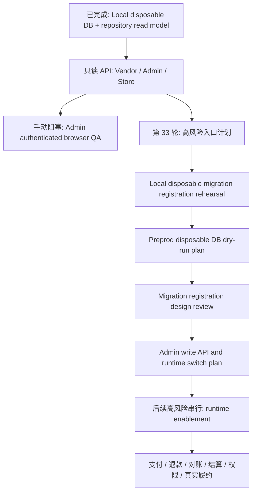

# Round 33 High-Risk Entry Plan

更新时间：2026-05-07 Asia/Shanghai

## 背景

第 32 轮已经完成 market membership 只读 DB QA：

- 本地 disposable DB repository integration passed。
- Vendor/Admin/Store 只读 read model helper 单测通过。
- Store/Admin markets readonly API 已可在表存在时优先读取 repository rows，表缺失或无数据时 fallback。
- `runtimeEnabled` 保持 `false`。
- `checkoutImpact` 保持 `none`。

当前自动队列只剩：

- `admin-market-membership-browser-qa`: `blocked-manual`

这意味着下一步不能再随意新增业务代码。后续会从“只读证据”进入“真实 DB / 写接口 / 模块开关生效”的边界，必须拆小、串行、可回滚。

## 第 33 轮原则

第 33 轮只允许推进下面两类任务：

1. 手动 QA handoff 或 docs-only 计划。
2. 本地 disposable DB 验证，不连接预发或生产 DB。

第 33 轮不允许：

- 注册生产 migration。
- 写 production seed。
- 接入预发或生产数据库。
- 新增 Admin 写接口。
- 让模块开关影响真实权限、菜单、checkout、订单、履约或支付。
- 修改 checkout、购物车、配送方式、订单、支付、退款、结算、佣金、权限或真实履约逻辑。
- 接入真实微信支付、支付宝、短信、IM、物流、直播或 AI provider。

## 任务顺序

### BR: High-Risk Entry Plan

状态：当前任务。

Scope:

- 固化第 33 轮高风险入口门禁。
- 说明剩余 blocked-manual 项。
- 规划后续任务顺序。

Verification:

- `git diff --check`
- `bun run prettier --check docs/round33-high-risk-entry-plan.md .codex/tasks/round33-high-risk-entry-plan.md .codex/queue.md docs/china-localization-task-list.md`

### BS: Admin Market Membership Browser QA Handoff

状态：blocked-manual，除非用户已登录 Admin 浏览器会话。

Scope:

- 使用用户已登录的 Codex App 浏览器检查 Admin market membership 只读页。
- 验证 ready / empty / fallback 三态。
- 截图保存到 `docs/visual-qa-artifacts/`。
- 只记录 QA 结果，不修改业务代码。

Entry gate:

- 用户已经打开并登录 `http://127.0.0.1:7000/dashboard`。
- Admin API 和前端 dev server 可达。
- 不能使用伪造登录态或模拟截图替代。

Exit gate:

- 记录页面 URL、截图、观察到的数据源状态。
- 若无法验证，保持 `blocked-manual`，不得标记 done。

### BT: Local Disposable Migration Registration Rehearsal

状态：建议 pending。

Scope:

- 仍然只使用本地 disposable DB。
- 模拟“如果未来注册 migration”，需要检查哪些模块发现、迁移顺序和 rollback 信号。
- 不修改 production config，不注册模块，不写真实 DB。

Entry gate:

- `.codex/scripts/market-membership-local-dry-run.sh` 和 repository integration test 都通过。
- 临时 DB 名称必须以 `fuyi_market_membership_dry_run_` 开头。
- 脚本必须确认目标 host 是 localhost / 127.0.0.1 / ::1。

Exit gate:

- 记录 migration up/down、约束、空表、最小 fixture 和 cleanup 结果。
- 证明没有遗留临时数据库。

### BU: Preprod Disposable DB Dry-Run Execution Plan

状态：建议 blocked-external。

Scope:

- 只写执行计划或 checklist。
- 不实际连接预发 DB，除非用户明确提供目标库并确认可丢弃。

Entry gate:

- 目标库必须是 disposable/preprod clone，不是生产库。
- 必须记录连接目标、备份点、回滚命令、负责人和退出标准。
- 必须确认没有真实用户订单、支付、退款、结算、佣金、权限或履约数据被改动。

Exit gate:

- 若未获得目标库确认，只能保持 blocked-external。
- 若执行，必须记录完整命令、输出摘要和 rollback 结果。

### BV: Migration Registration Design Review

状态：建议 docs-only。

Scope:

- 评审真实 migration 注册点、模块边界、rollback 策略和部署顺序。
- 不写代码。

Entry gate:

- 本地 disposable DB 和预发 disposable DB 证据齐全。
- Admin/Store/Vendor 只读 fallback 均已验证。

Exit gate:

- 形成可执行 PR 拆分：注册 migration、空表 read-only 验证、fixture-only 验证、关闭开关回滚。

### BW: Admin Write API And Runtime Switch Plan

状态：建议 docs-only。

Scope:

- 设计 Admin 市场配置、模块开关、商户类型开关的写接口和审计。
- 明确 write API 与 runtime effective config 分离。

Non-goals:

- 不实现写接口。
- 不让开关真实生效。
- 不修改权限或订单相关逻辑。

Exit gate:

- 写接口必须有幂等、审计、权限、回滚和 feature flag。
- runtime 生效必须另起高风险串行任务。

## 暂停条件

遇到以下任一情况必须暂停并记录：

- 需要连接预发或生产 DB。
- 需要写入真实数据。
- 需要注册 migration 到真实运行路径。
- 需要 Admin 写接口保存配置。
- 需要模块开关影响真实菜单、权限、checkout、订单、履约或支付。
- 需要真实支付、退款、对账、商家结算、权限或履约。
- 需要真实微信支付、支付宝、短信、IM、物流、直播或 AI provider。
- 浏览器 QA 需要用户登录态但当前会话不可用。

## 系统边界图

## 下一步建议

自动队列可以继续做：

1. `local-disposable-migration-registration-rehearsal`
2. `migration-registration-design-review`
3. `admin-write-api-runtime-switch-plan`

自动队列必须跳过：

- `admin-market-membership-browser-qa`，直到用户登录 Admin 浏览器。
- `preprod-disposable-db-dry-run-execution`，直到用户明确提供可丢弃目标库并确认回滚。
- 任何支付、退款、对账、商家结算、权限、真实履约或真实 provider 任务。
