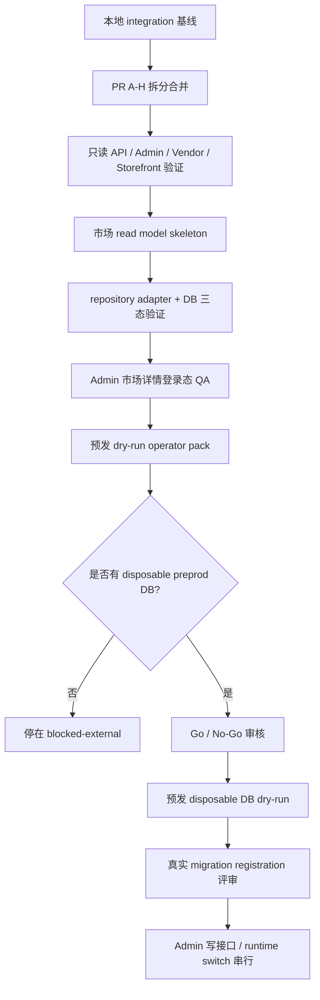

# Round 36 Safe Next Execution Map

更新时间：2026-05-07 13:20 Asia/Shanghai

## 结论

自动队列当前没有可继续执行的普通实现任务。

唯一剩余的下一步主线任务是：

- `preprod-disposable-db-dry-run-execution`: `blocked-external`

它需要用户明确提供可丢弃预发数据库、备份或无需备份说明、回滚确认和执行窗口。没有这些条件时，不能自动连接预发或生产数据库。

## 当前完成状态

## 可继续的安全任务类型

在没有预发 DB 的情况下，只能继续以下类型：

- docs-only 设计复核。
- 本地 disposable DB rehearsal。
- 本地只读 API / 前端登录态 QA。
- 高风险任务的边界文档和 PR 拆分计划。
- 环境变量、CORS、cookie/session、mock provider 的上线前审计清单。

这些任务必须继续遵守：

- 不改 `apps/**` 或 `packages/**`，除非任务文件明确允许。
- 不连接预发或生产 DB。
- 不注册真实 migration。
- 不实现 Admin 写接口。
- 不让 runtime switch 影响权限、checkout、订单、履约或支付。

## 不能自动继续的任务

以下任务必须等待外部条件或单独确认：

| 任务 | 状态 | 阻塞原因 |
| --- | --- | --- |
| `preprod-disposable-db-dry-run-execution` | blocked-external | 需要 disposable preprod DB、备份和回滚确认 |
| `market-membership-registration` | blocked-high-risk | 需要先通过预发 dry-run |
| `admin-write-api-implementation` | blocked-high-risk | 会进入写接口、审计、幂等和权限边界 |
| `runtime-switch-effective-read` | blocked-high-risk | 可能影响菜单显隐、权限或业务运行态 |
| `payment-provider-realization` | blocked-high-risk | 涉及支付通知验签、幂等、重试和状态机 |
| `refund-reconciliation-settlement` | blocked-high-risk | 涉及退款、对账、结算、佣金和资金风险 |

## 下一阶段建议顺序

### Gate 1: 预发 dry-run 准备

输入：

- `docs/preprod-dry-run-operator-pack.md`
- disposable preprod DB
- 备份 / 回滚确认

输出：

- dry-run 日志路径
- Go / No-Go 记录
- up/down 或 drop/restore 结果
- read model 三态验证
- Admin / Vendor / Storefront 只读三态验证

### Gate 2: Migration registration

只有 Gate 1 通过后才允许。

范围：

- 注册真实 migration / module。
- 不写 seed。
- 不切 runtime。
- 不加 Admin 写接口。

### Gate 3: Admin write API draft layer

只有 migration registration 合并并验证后才允许。

范围：

- draft 写入。
- audit log。
- idempotency。
- validation。
- 仍不让配置生效。

### Gate 4: Published / effective read model

范围：

- 从 draft 到 published。
- effective 只读合成。
- runtimeEnabled 仍默认 false。
- 不影响 checkout、订单、支付、履约。

### Gate 5: Runtime switch controlled rollout

范围：

- 单市场、单模块、单商户类型灰度。
- 完整 rollback。
- 审计可追踪。

## 高风险串行原则

支付、退款、对账、商家结算、佣金、权限、真实配送履约、真实 provider 不能并行混在普通 UI / docs / read-only PR 中。

每个高风险任务都必须单独包含：

- 数据模型影响。
- 状态机影响。
- 幂等策略。
- 签名或权限校验。
- 重试和回滚。
- 观测日志。
- 本地、预发、生产前 gate。

## 当前建议动作

在用户没有提供 disposable preprod DB 前，建议只做以下两类工作：

1. 保持 main 稳定，等待外部 DB 条件。
2. 如需继续推进，可开 docs-only 的高风险 PR 拆分计划，例如：
   - `payment-notification-idempotency-plan`
   - `refund-reconciliation-serial-plan`
   - `settlement-commission-risk-plan`
   - `runtime-switch-rollout-plan`

这些计划不能实现业务逻辑，只能定义边界、验收和回滚。
