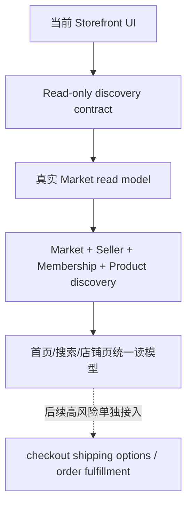
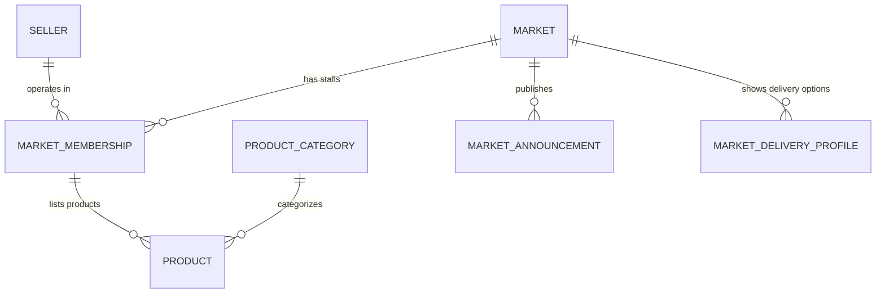

# Storefront Real Discovery Bridge

更新时间：2026-05-07 Asia/Shanghai

## 结论

Storefront 下一阶段要从“本地化 UI + mock/read-only 数据”过渡到“真实市场、商户、档口、类目、商品发现数据”。

本计划只做桥接设计，不修改 `apps/storefront/**` 或 `packages/api/**`。它不改变 checkout、cart total、shipping options、payment、order、refund、settlement、commission 或 permission 逻辑。

## 消费端主线

消费者的主线应该是：

```text
选择城市/市场 -> 找店铺/档口 -> 看今日鲜货/商品 -> 进入商品详情 -> 加购物车 -> 按档口确认配送/自提 -> 结算
```

原则：

- 首页先服务消费者找市场、找店、找鲜货。
- 提货卡是独立入口，不塞进首页主信息流。
- 直播最多作为店铺/档口状态标记，不作为首页主模块。
- 物料采购、配送供应商、自提配送设置属于商户/后台能力，不放到消费者首页前排。
- UI 模板可以后续替换，但数据合同要稳定。

## 当前状态

已具备：

- `/store/china/discovery` 只读 API。
- `/store/china/sellers/:handle/products` 只读 API。
- Storefront 首页、搜索、店铺页、商品详情、购物车、结算页的中国本地化基础版。
- 商品数据优先读取 Store API，静态市场鲜货作为样例降级。
- 店铺页可以从 seller metadata 读取市场、档口、履约说明。

当前限制：

- 市场仍是静态配置契约，不是真实 `china_market` 模型。
- 店铺和档口关系主要来自 seller metadata。
- 首页布局已经多轮调整，但数据来源还没完全稳定。
- 搜索、首页、店铺页的读模型没有统一 contract。

## 阶段图



边界：

- A 到 E 是发现和展示链路。
- E 到 F 是交易和履约链路，必须另开高风险串行 PR。

## 数据关系



Storefront 只读需要：

- market list
- active market
- seller/stall list
- seller profile
- category list
- product cards
- product detail
- announcement
- delivery profile display hint

## 首页读模型

首页目标：清楚、稳定、找货快。

建议数据块：

1. 城市/市场选择
2. 搜索框
3. 市场类目
4. 推荐档口/商户
5. 今日鲜货
6. 市场公告
7. 服务入口

不建议放到首页主信息流：

- 提货卡大模块。
- 直播大模块。
- 物料采购。
- 配送供应商。
- 自提/配送配置。
- 商户后台功能说明。

首页 API 建议：

```text
GET /store/china/discovery/home?market_slug=
```

返回：

- `market`
- `categories`
- `featured_sellers`
- `fresh_products`
- `announcements`
- `service_links`

注意：第一版也可以继续复用 `/store/china/discovery`，但要明确 home view shape，避免页面各自拼数据。

## 搜索页读模型

搜索页目标：先找店，再看商品。

建议数据块：

1. 搜索关键词。
2. 市场/类目筛选。
3. 店铺/档口结果。
4. 商品结果。
5. 相关类目。

搜索 API 建议：

```text
GET /store/china/discovery/search?q=&market_slug=&category_id=
```

返回：

- `matched_sellers`
- `matched_products`
- `matched_categories`
- `market_context`

非目标：

- 不做复杂排序。
- 不做距离计算。
- 不做库存聚合。
- 不接 Algolia 或真实搜索 provider。

## 店铺页读模型

店铺页目标：一个档口/商户自己的主页。

建议数据块：

1. 店铺/档口头部。
2. 市场和档口号。
3. 营业时间/公告。
4. 店铺装修模块。
5. 正在直播轻量状态。
6. 今日鲜货/商品列表。
7. 配送/自提说明。
8. 售后/资质/联系方式占位。

店铺 API 建议：

```text
GET /store/china/sellers/:handle
GET /store/china/sellers/:handle/products?market_slug=&category_id=
```

注意：

- 配送/自提说明是店铺或市场能力，不是商品标题旁的硬编码标签。
- 是否真正可选统一配送，要到 checkout shipping options 阶段单独接。

## 商品卡读模型

商品卡应该展示商品本身，少放后台能力。

建议字段：

- 商品名。
- 规格摘要。
- 价格和计价单位。
- 起售数量。
- 库存口径。
- 档口/市场。
- 商品提示，如鲜活、今日到货、建议自提。

不要把以下内容写成商品属性：

- 市场是否开启统一配送。
- 商户是否允许自配送。
- 物料供应商接单。
- 提货卡能力。

这些应属于市场/店铺/后台能力。

## 数据合同不能乱改的部分

后续 UI 模板可以随意替换：

- 首页卡片布局。
- 色彩和密度。
- 商品卡排列。
- 店铺装修模板。
- 移动端导航。

但以下合同不能随意改：

- market slug 和 market id。
- seller handle 和 seller id。
- market membership。
- booth no。
- category id。
- product id。
- price type 和 unit。
- delivery profile 的展示含义。
- pickup card 独立入口。
- live status 仅作为轻量状态。

## PR 拆分

### PR N1：本文档

只做设计。

### PR N2：Discovery view shape

范围：

- 定义 home/search/seller read model 类型。
- 可以先用现有 `/store/china/discovery` 数据组装。
- 不改 UI。

### PR N3：Store API bridge

范围：

- 新增或扩展只读 Store API。
- 首页、搜索、店铺页都读取同一批 read model。

验证：

```bash
./node_modules/.bin/tsc --noEmit -p packages/api/tsconfig.json
cd packages/api && ../../node_modules/.bin/medusa build
```

### PR N4：Storefront home bridge

范围：

- 首页读取 home view。
- 移除重复搜索/重复类目。
- 保持提货卡独立入口。

验证：

```bash
cd apps/storefront && bun run build
```

### PR N5：Storefront search bridge

范围：

- 搜索页读取 search view。
- 店铺结果和商品结果分区。

### PR N6：Seller page bridge

范围：

- 店铺页读取 seller profile 和 products view。
- 配送/自提说明放到店铺层。

### PR N7：Visual template pass

范围：

- 在数据合同稳定后再调整 UI 模板。
- 可对照国内批发/本地生活/爱采购式信息密度做视觉优化。

非目标：

- 不改数据合同。
- 不改 checkout。

## 验收路径

文档阶段：

```bash
git diff --check -- docs/storefront-real-discovery-bridge.md docs/storefront-location-plan.md docs/storefront-zhcn-baseline.md project-ledger .codex/queue.md
git diff --name-status
```

API 阶段：

```bash
./node_modules/.bin/tsc --noEmit -p packages/api/tsconfig.json
cd packages/api && ../../node_modules/.bin/medusa build
curl -H "x-publishable-api-key: <local-pk>" http://127.0.0.1:9000/store/china/discovery
```

Storefront 阶段：

```bash
cd apps/storefront && bun run build
```

页面 smoke：

- `/cn`
- `/cn/search?q=梭子蟹`
- `/cn/sellers/a-hai-xian-huo-dang`
- `/cn/products/sweatpants`

## 风险边界

不要在 discovery bridge PR 中混入：

- checkout shipping options。
- cart total。
- 支付结果判定。
- 订单状态。
- 退款。
- 结算、佣金、payout。
- 权限或菜单真实显隐。
- 真实客服、直播、物流、AI、支付 provider。

## 下一步

完成本文档后，第十三轮 docs-only 队列清空。下一批应进入真实代码前的子任务拆分：

1. API read model skeleton。
2. Storefront discovery view shape。
3. Admin/Vendor 只读市场和模块配置读取。
4. Vendor draft product skeleton。

每个实现 PR 都必须小范围、可验证、不可混入交易链路。
