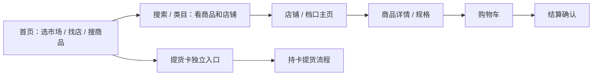

# Storefront Template Contract Plan

更新时间：2026-05-08 Asia/Shanghai

## 目标

为消费者端建立模板合同。后续可以继续学习国内采购、电商、社区团购或本地生活平台的视觉方式，但模板必须围绕“市场 -> 店铺/档口 -> 今日鲜货 -> 下单确认”这个消费者路径组织。

这份规划不修改页面，只定义后续 Storefront 模板应读取什么、隐藏什么、不能决定什么。

## 用户路径



消费者端主路径是买生鲜海鲜，不是商户采购平台入口。物料供应商、配送供应商、养殖户、种植户、种苗供应商和外地批发商属于商户/平台运营视角，默认不进入消费者首页主路径。

## 首页模板合同

首页应该承担：

- 当前市场和市场切换入口。
- 搜索框。
- 市场类目或常买类目。
- 推荐店铺/档口。
- 今日鲜货或热卖商品。
- 消费者保障、售后和配送说明入口。

首页不应该承担：

- 物料供应商采购主入口。
- 配送供应商接单入口。
- 提货卡兑换主流程。
- 直播频道主入口。
- 支付、退款、结算、佣金或权限状态展示。

首页 view model 建议：

```text
market_context
category_groups
featured_shops
fresh_products
consumer_notices
service_promises
template_slots
```

## 搜索和类目模板合同

搜索/类目页应该支持：

- 搜索关键词。
- 商品结果。
- 店铺/档口结果。
- 市场范围。
- 类目筛选。
- 价格、规格、库存展示。
- 是否支持自提/配送的店铺级提示。

不建议在商品卡片上堆过多运营标签。配送方式可以在商品卡片轻提示，但最终解释应回到店铺/档口和结算页。

搜索 view model 建议：

```text
query
market_context
product_results
shop_results
category_filters
sort_options
empty_state
```

## 店铺和档口主页模板合同

店铺页是消费者端最重要的模板。它应承接用户提出的“以店为主”。

店铺页应该展示：

- 店铺名称、市场、档口号。
- 营业状态、营业时间和公告。
- 主营类目。
- 配送方式：市场统一配送、商家自配送、自提。
- 店铺装修模块。
- 正在直播状态，最多作为店铺状态或局部入口。
- 商品列表和规格。
- 售后、资质、评价和联系方式占位。

店铺页不应展示：

- 商户结算信息。
- 配送供应商接单后台。
- 物料供应商采购后台。
- 供应链上游内部对接详情。
- 支付 provider 或权限状态。

店铺 view model 建议：

```text
shop_profile
market_memberships
booth
business_hours
announcements
fulfillment_options
decoration_snapshot
live_status
product_sections
service_notes
```

## 商品详情模板合同

商品详情页应该展示消费者决策信息：

- 商品名称。
- 图片。
- 规格和单位，例如斤、盒、箱、份。
- 价格区间和当前规格价格。
- 库存或供应状态。
- 店铺和档口信息。
- 配送/自提提示。
- 售后规则。

商品详情页不应把配送能力写成商品核心属性。配送方式属于店铺/档口能力和结算确认，商品页只提示可用方式。

商品 view model 建议：

```text
product
variants
price_display
inventory_hint
shop_summary
fulfillment_hint
after_sales_hint
recommendations
```

## 提货卡模板合同

提货卡必须保持独立入口和独立流程。它面向持卡消费者：

- 识别卡权益。
- 展示可提货商品或套餐。
- 补齐规格、地址或自提时间。
- 提交提货申请。
- 等待履约。

提货卡不是：

- 优惠券。
- 满减券。
- 折扣券。
- 储值卡。
- 余额。
- 支付方式。
- 普通购物车抵扣。

提货卡 view model 建议：

```text
card_lookup_state
entitlement_summary
claimable_items
recipient_form_schema
pickup_or_delivery_options
claim_status
support_notes
```

## 移动端模板合同

移动端应更像 App：

- 顶部固定市场和搜索。
- 底部 Tab 或固定导航。
- 首页短一些，避免把所有模块纵向堆满。
- 商品卡以图片、名称、规格、价格、店铺为主。
- 店铺页突出档口号、营业状态、配送方式和商品分组。
- 购物车/结算入口固定且清楚。

移动端不建议：

- 大面积说明文字。
- 过多同级搜索框。
- 把 B 端采购、配送供应商、平台能力说明塞到消费者首页。
- 用大块 footer 卡片堆叠占满屏幕。

## 模板可变项和不可变项

可变：

- 布局。
- 颜色。
- 间距。
- 模块顺序。
- 卡片密度。
- 导航样式。
- 首页运营位。

不可变：

- 商品、订单、支付、退款、结算、佣金、权限和履约事实来源。
- 提货卡独立流程。
- 直播只作为店铺状态。
- 物料/配送供应商默认不进消费者主路径。
- 市场、商户、档口、配送方式必须来自稳定 view model 或明确演示数据。

## 后续 PR 建议

1. `storefront-template-view-shape`：定义纯 TypeScript Storefront template view shape，不接页面。
2. `storefront-template-registry-static`：静态 registry，列出 home/search/shop/product/pickup-card 模板 id。
3. `storefront-template-preview-docs`：文档化如何把设计稿映射到模板 slot。
4. `storefront-template-home-v2`：小范围替换首页模板，并做桌面/移动端截图验证。
5. `storefront-template-shop-v2`：小范围替换店铺页模板，并验证档口、配送、自提和直播状态位置。

## 本轮结论

Storefront 后续可以大胆做模板，但不能再散点式改页面。每次改版前先说明模板 id、读取的 view model、隐藏的 B 端能力和不会触碰的交易链路。这样消费者界面可以持续打磨，后端数据合同也不会被视觉修改牵着走。
