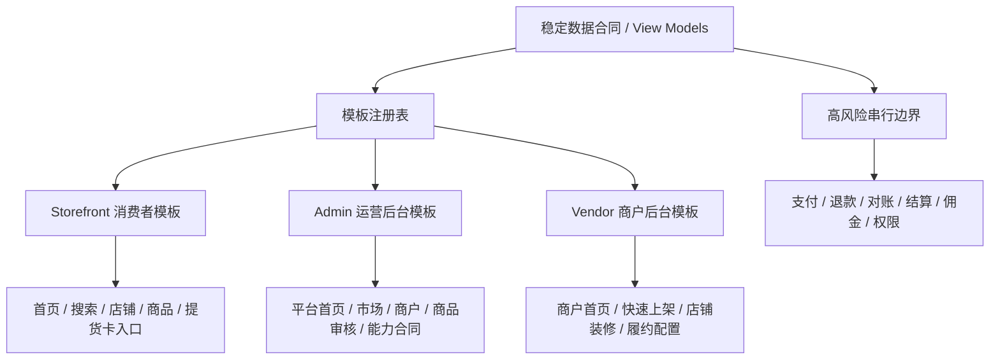

# UI Template System Plan

更新时间：2026-05-08 Asia/Shanghai

## 目标

把三端界面改造从“单次页面调整”升级成“可替换模板系统”的规划。后续无论消费者首页、店铺页、Admin 运营后台还是 Vendor 商户后台怎么换版式，都应只替换展示层，不破坏数据合同和交易链路。

## 核心原则

- 模板负责布局、视觉密度、文案呈现和模块排列。
- 数据合同负责字段、状态、权限边界和风险提示。
- 模板只能消费稳定 view model，不能直接决定订单、支付、退款、结算、佣金、权限或履约事实。
- 模板可以快速替换，但 checkout、payment、order、refund、settlement、commission、payout、permission 和 fulfillment runtime 必须独立串行推进。
- 本地演示模板和生产模板必须通过配置或注册表切换，不能靠临时改页面散落实现。

## 总体结构



## Storefront 模板边界

消费者端模板应该围绕“先找市场和店，再看商品”设计：

- 首页：市场入口、店铺/档口推荐、今日鲜货、搜索入口和消费者保障。
- 搜索页：商品结果、店铺结果、类目筛选和市场上下文。
- 店铺页：档口号、营业状态、配送/自提方式、店铺装修、直播状态和商品列表。
- 商品页：规格、价格、库存、商家、配送提示和售后提示。
- 提货卡：独立入口，不放首页主业务流，不接 checkout 抵扣。

模板层不应展示给消费者的内容：

- 物料供应商采购主入口。
- 配送供应商接单入口。
- 养殖户、种植户、种苗供应商和外地批发商的后台供给关系。
- 支付、退款、结算、佣金和权限状态。

## Admin 模板边界

Admin 模板是平台运营后台，不是营销页面。它应该优先支持：

- 平台首页：交易占位指标、待办、风险提醒、快捷入口和数据来源说明。
- 市场管理：市场、档口、营业时间、公告、配送规则。
- 商户管理：商户类型、跨市场归属、档口号、资质和审核状态。
- 商品管理：商品审核、规格模板、禁售规则和类目。
- 营销与提货卡：提货卡发行、激活、提货、冻结、渠道和日志，只做独立业务，不混成优惠券。
- 能力合同：市场、商户角色、店铺装修、快速上架、直播、面单和高风险边界。

Admin 模板可以重排菜单和看板，但不能用模板开关替代真实权限、审计、支付成功、结算或履约状态。

## Vendor 模板边界

Vendor 模板是商户工作台，应按角色显示不同工作重点：

- 普通生鲜/海鲜商户：商品、订单、售后、店铺装修、客服和经营数据。
- 水果蔬菜商户：规格、产地、批次、保鲜和配送提示。
- 物料供应商：泡沫箱、包装箱、冰袋、冰块等商户采购入口，面向商户，不面向消费者首页。
- 配送供应商：配送能力、服务区域、接单状态和异常处理，不能直接改订单履约事实。
- 养殖户/种植户：上游供给关系、报价、批次和对接商户。
- 种苗供应商：种苗批发、供给关系和对接角色。
- 外地批发商：跨区域供给、对接商户和履约承诺。

Vendor 模板可以支持手机快速上架和 AI 草稿入口，但真实发布商品必须经过后端合同、审核和权限边界。

## 模板注册表建议

后续可以设计一个只读模板注册表：

```text
template_id
surface: storefront | admin | vendor
scenario: home | search | shop | dashboard | product_draft | capability
market_scope: global | market | merchant_type
status: draft | preview | active | paused
version
view_model_contract
feature_boundaries
```

第一阶段建议只做静态 registry 和文档，不写数据库、不做动态切换。

## PR 拆分建议

第九十六轮可以按以下顺序推进：

1. `ui-template-system-plan`：docs-only 总规划。
2. `storefront-template-contract-plan`：规划消费者端模板合同，不改页面。
3. `admin-template-contract-plan`：规划运营后台模板合同，不改页面。
4. `vendor-template-contract-plan`：规划商户后台模板合同，不改页面。
5. `template-registry-readonly-contract`：新增纯 TypeScript view shape skeleton，不接 route、不接 DB。
6. `template-system-validation`：focused tests、typecheck 和 ledger 收口。

## 验证策略

每个模板 PR 必须说明：

- 消费者、平台运营或商户使用场景。
- 读取的 view model contract。
- 不读取或不改变的高风险字段。
- 桌面和移动端验证方式。
- 回滚方式：切回旧模板或禁用新模板注册项。

## 本轮结论

接下来不要继续散点式改页面。先把模板系统合同规划清楚，再小步接静态 registry、preview 和可回滚切换。这样以后视觉稿可以大胆换，数据和上线风险仍然可控。
