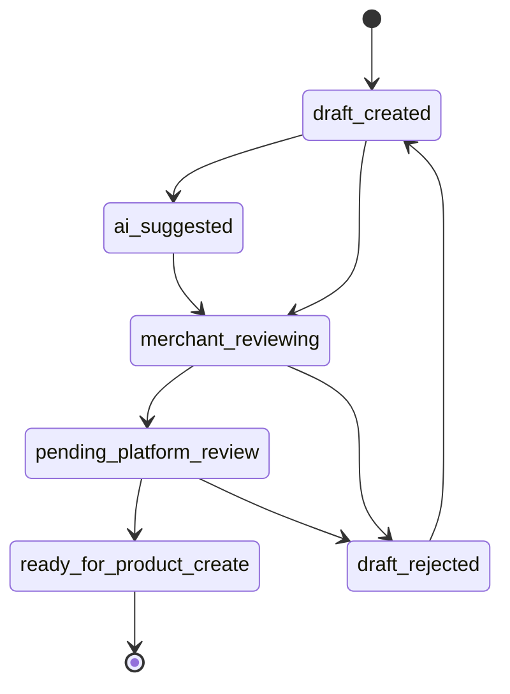

# Vendor 手机快速上架与 AI 草稿 API 设计

日期：2026-05-03

## 目标

为商家后台的手机快速上架和 AI 一句话上架设计后端合同。本文只写设计，不创建 API、不写 migration、不接真实 AI、微信、IM、短信、物流，也不改变商品、库存、订单、支付、退款、结算、佣金或权限逻辑。

## 核心原则

- 快速上架先进入 `draft`。
- AI 只能生成草稿和建议，不能直接正式发布商品。
- 商户必须人工确认后，才允许进入后续商品创建或更新流程。
- 草稿保存的是商户输入和 AI 建议，不代表平台审核通过。
- 生鲜商品、市场物料商品、上游货源报价需要分清业务链路，不混入消费者首页主链路。

## 与读写落地计划的关系

后续落地以 `docs/vendor-draft-product-readwrite-plan.md` 为执行拆分。

关键边界：

- `draft` 只保存商户输入、规格选择和 AI suggestion。
- `ready_for_product_create` 只是商品创建候选，不是已发布商品。
- AI suggestion 不直接覆盖商户确认字段。
- 真实创建 Medusa product、库存初始化、图片转存、审核发布必须另开 PR。

## 草稿状态机

状态说明：

- `draft_created`：手机快速表单或基础输入创建。
- `ai_suggested`：AI mock/provider 返回字段建议。
- `merchant_reviewing`：商户确认标题、价格、库存、规格、图片和履约方式。
- `pending_platform_review`：需要平台审核的类目、证照或风险词。
- `ready_for_product_create`：后续真实商品创建流程的输入候选，不等同于已上架。
- `draft_rejected`：商户或平台驳回。

## 建议数据模型

### VendorProductDraft

字段：

- `id`
- `vendor_id`
- `market_id`
- `stall_no`
- `merchant_type`
- `source`: `mobile_form`、`ai_text`、`ai_voice`、`ai_image`、`template`
- `status`
- `title`
- `category_key`
- `description`
- `origin_place`
- `specs`
- `unit`
- `suggested_price`
- `stock_text`
- `temperature_band`: `ambient`、`chilled`、`frozen`
- `freshness_window`
- `packaging`
- `fulfillment_modes`: `market_pickup`、`local_delivery`、`cold_chain`、`express`
- `image_object_keys`
- `credential_refs`
- `ai_trace_id`
- `risk_warnings`
- `created_by`
- `updated_by`
- `created_at`
- `updated_at`

### VendorProductDraftSuggestion

字段：

- `id`
- `draft_id`
- `provider`: `mock_ai_listing`
- `source_payload_digest`
- `suggested_fields`
- `confidence`
- `warnings`
- `created_at`

### VendorProductDraftAuditLog

字段：

- `id`
- `draft_id`
- `actor_id`
- `actor_role`
- `action`
- `before_status`
- `after_status`
- `reason`
- `trace_id`
- `created_at`

## API 草案

Vendor 草稿：

- `POST /vendor/china/product-drafts`
- `GET /vendor/china/product-drafts`
- `GET /vendor/china/product-drafts/:id`
- `PATCH /vendor/china/product-drafts/:id`
- `POST /vendor/china/product-drafts/:id/submit-review`
- `POST /vendor/china/product-drafts/:id/cancel`

AI 草稿建议：

- `POST /vendor/china/product-drafts/ai/text`
- `POST /vendor/china/product-drafts/ai/voice`
- `POST /vendor/china/product-drafts/ai/image`
- `POST /vendor/china/product-drafts/:id/ai/suggest`
- `POST /vendor/china/product-drafts/:id/validate`

只读配置：

- `GET /vendor/china/current-market`
- `GET /vendor/china/listing-templates`
- `GET /vendor/china/listing-capabilities`

## 手机快速上架字段

必填最小集：

- 商品名
- 类目
- 规格
- 单位
- 今日价或报价
- 库存/到货说明
- 市场和档口
- 履约方式

生鲜扩展：

- 鲜活/冰鲜/冷冻/常温
- 产地
- 净重/毛重
- 起订量
- 保鲜期
- 包装方式
- 配送或自提时间窗

物料供应商扩展：

- 物料类型：泡沫箱、包装箱、冰袋、冰块、周转筐、胶带、标签
- 规格尺寸
- 最小起订量
- 批发阶梯价
- 配送范围
- 是否支持商户自提

## AI 草稿边界

- AI 输入可以来自文本、语音 object key、图片 object key。
- 后端只保存 object key/reference，不暴露长期公开 URL。
- AI 输出必须带 `source: mock` 或 provider 标识。
- AI 输出字段必须进入草稿，不直接写商品表。
- AI 低置信度或敏感词必须进入 `merchant_reviewing` 或 `pending_platform_review`。
- AI 不判断食品安全、产地证明、证照真实性或平台处罚。

## 后续真实商品创建边界

当草稿进入 `ready_for_product_create` 后，仍需单独高风险或中风险 PR 设计：

- 商品创建 workflow。
- 库存初始化。
- 图片上传/转存。
- 平台审核。
- 类目与属性映射。
- 商户权限与市场能力判断。

## 验证要求

- AI draft API 不得创建真实商品。
- 草稿更新必须记录 audit log。
- 商户只能访问自己的草稿。
- 模块开关关闭时，后端必须拒绝 AI 草稿或快速上架写操作。
