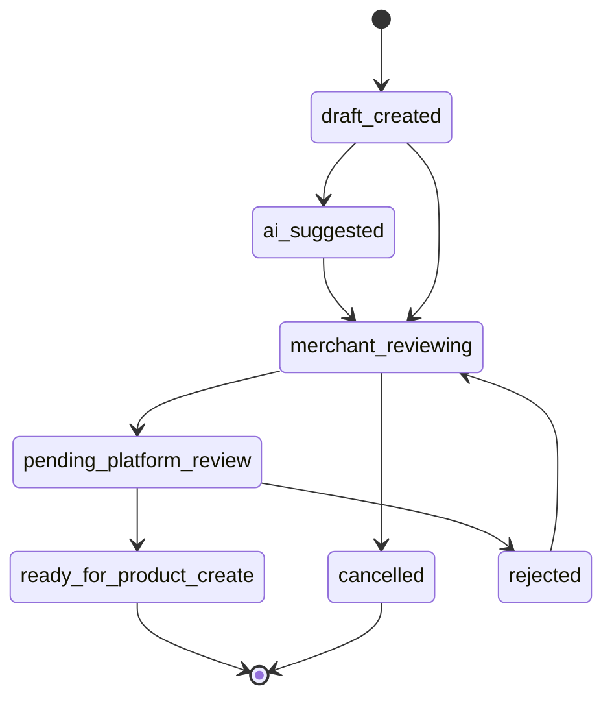

# Vendor Draft Product Read/Write Plan

更新时间：2026-05-07 Asia/Shanghai

## 结论

Vendor 手机快速上架和 AI 一句话上架下一步应该先落“商品草稿”读写模型，而不是直接创建真实商品。

本计划只做文档拆分，不写业务代码，不发布真实商品，不改库存、订单、支付、退款、结算、佣金、权限或履约逻辑。

## 当前基线

已合并主线具备：

- Vendor 中国商户后台壳。
- 手机快速上架、AI 草稿、规格模板的 UI/文档基础。
- Mock AI Listing Provider skeleton。
- `docs/vendor-draft-product-api-design.md` 已定义草稿状态机和 API 草案。
- `docs/product-spec-model.md` 已明确规格、价格、库存、履约分开建模。

缺口：

- 没有草稿真实读写模型。
- 没有规格模板只读 API。
- 没有 AI mock parser 到草稿字段的稳定合同。
- 没有“草稿保存”和“正式商品发布”的强制分离。

## 核心分层

### Draft Layer

保存商户输入、规格选择、AI 建议和审核状态。

允许：

- 手机端保存草稿。
- PC 端继续编辑草稿。
- AI mock parser 生成建议字段。
- 商户查看、修改、取消、提交审核。

禁止：

- 创建真实 Medusa product。
- 初始化库存。
- 改变商品可见性。
- 改变订单或支付链路。

### Review Layer

平台或规则引擎检查草稿是否可进入商品创建候选。

检查内容：

- 商户是否属于当前市场。
- 商户类型是否允许发布该类商品。
- 规格模板是否匹配类目。
- 价格、单位、库存字段是否完整。
- 风险词、证照、产地或食品安全提示是否需要人工审核。

### Product Creation Layer

真实创建商品的后续独立流程。

必须单独 PR：

- Medusa product 创建 workflow。
- 商品审核。
- 库存初始化。
- 图片转存。
- 类目和规格映射。
- 上架/下架状态。
- 权限和审计。

## 建议模型

### `china_vendor_product_draft`

| 字段 | 说明 |
| --- | --- |
| `id` | 草稿 ID |
| `seller_id` | 商户 ID |
| `market_id` | 当前市场 ID |
| `membership_id` | 档口/市场关系 |
| `source` | `mobile_form` / `pc_form` / `ai_text` / `ai_voice` / `ai_image` / `template_copy` |
| `status` | 草稿状态 |
| `title` | 商品名 |
| `category_id` | 类目 |
| `spec_template_id` | 规格模板 |
| `spec_values` | 规格字段 JSON |
| `price_type` | fixed/range/market/ladder/weighed |
| `price_payload` | 价格 JSON |
| `sales_unit` | 销售单位 |
| `price_unit` | 计价单位 |
| `stock_unit` | 库存单位 |
| `package_unit` | 包装单位 |
| `stock_text` | 库存说明 |
| `fulfillment_hints` | 商品层履约提示 |
| `image_refs` | 图片 object key/reference |
| `ai_trace_id` | AI 建议追踪 |
| `risk_warnings` | 风险提示 |
| `created_by` | 创建人 |
| `updated_by` | 更新人 |
| `created_at` | 创建时间 |
| `updated_at` | 更新时间 |

### `china_vendor_product_draft_suggestion`

保存 AI 或模板建议，不覆盖商户确认字段。

字段：

- `draft_id`
- `provider`
- `source_type`
- `source_digest`
- `suggested_fields`
- `confidence`
- `warnings`
- `created_at`

### `china_vendor_product_draft_audit`

所有状态变化和字段关键修改都要审计。

字段：

- `draft_id`
- `actor_id`
- `actor_type`
- `action`
- `before_snapshot`
- `after_snapshot`
- `reason`
- `request_id`
- `created_at`

## 草稿状态机



状态边界：

- `ready_for_product_create` 仍不是已发布商品。
- `cancelled` 不删除审计。
- `rejected` 可以回到商户编辑，但必须保留驳回原因。

## API 拆分

### PR M1：文档计划

当前任务。只写文档。

### PR M2：规格模板只读 API 计划

范围：

- `GET /vendor/china/spec-templates`
- `GET /vendor/china/spec-templates/:id`
- 按市场、商户类型、类目返回可用规格模板。

非目标：

- 不允许商户编辑平台规格模板。
- 不发布商品。

### PR M3：草稿模型 skeleton

范围：

- API 模块/model/service skeleton。
- migration 和 service 可以存在，但不接真实发布。
- 写入只限 draft 表。

验证：

```bash
./node_modules/.bin/tsc --noEmit -p packages/api/tsconfig.json
cd packages/api && ../../node_modules/.bin/medusa build
```

### PR M4：Vendor draft API

范围：

- `POST /vendor/china/product-drafts`
- `GET /vendor/china/product-drafts`
- `GET /vendor/china/product-drafts/:id`
- `PATCH /vendor/china/product-drafts/:id`
- `POST /vendor/china/product-drafts/:id/cancel`

安全要求：

- 当前用户只能访问自己 seller 的草稿。
- 所有写入必须记录 audit。
- 不创建真实商品。

### PR M5：AI mock parser bridge

范围：

- `POST /vendor/china/product-drafts/ai/text`
- `POST /vendor/china/product-drafts/:id/ai/suggest`
- 使用 MockAiListingProvider。
- 保存 suggestion，不直接覆盖商户确认字段。

禁止：

- 不接真实 OpenAI、微信、图片识别或语音服务。
- 不写真实密钥。

### PR M6：Vendor UI 读写草稿

范围：

- 手机快速上架写 draft。
- AI 草稿预览写 suggestion。
- PC 完整编辑读取同一 draft。

非目标：

- 不发布商品。
- 不改库存。

### PR M7：Review and ready state

范围：

- 草稿提交平台审核。
- 生成 `ready_for_product_create` 候选。

仍不创建真实商品。

### PR M8：Product creation workflow

范围：

- 从 ready draft 创建真实商品。

风险：

- 中高风险。必须单独设计商品审核、权限、库存、图片、回滚和发布状态。

## 字段校验

草稿保存最小校验：

- `seller_id` 属于当前用户。
- `market_id` 是当前商户可经营市场。
- `title` 非空。
- `category_id` 可为空，但提交审核前必须有。
- 价格、单位、库存可以先保存文本，但提交审核前必须结构化。

提交审核校验：

- 规格模板和类目匹配。
- 销售单位、计价单位、库存单位已填写。
- 价格类型字段完整。
- 生鲜类目需有鲜活/冰鲜/冷冻/常温等 freshness 字段。
- 物料类目不能进入消费者商品主链路。
- AI 建议必须被商户确认。

## AI mock parser 合同

输入：

```json
{
  "text": "今天梭子蟹公母混装，3到5两一只，68到82一斤，1斤起，剩36筐，建议自提",
  "market_id": "market_sanmen_demo",
  "seller_id": "sel_demo"
}
```

输出：

```json
{
  "provider": "mock_ai_listing",
  "confidence": 0.82,
  "suggested_fields": {
    "title": "鲜活梭子蟹",
    "spec_values": {
      "spec_name": "公母混装",
      "size": "3-5两/只",
      "min_order": "1斤起"
    },
    "price_type": "range",
    "price_payload": {
      "min": 68,
      "max": 82,
      "unit": "斤"
    },
    "stock_text": "剩36筐",
    "fulfillment_hints": ["建议自提"]
  },
  "warnings": []
}
```

边界：

- AI 输出只是 suggestion。
- 商户确认后才写入 draft 主字段。
- 低置信度进入人工编辑。
- 风险词进入平台审核。

## 正式发布前置条件

进入真实商品创建前必须满足：

- 商户有当前市场经营 membership。
- 商户类型允许发布对应类目。
- 商品类目与规格模板匹配。
- 价格、单位、库存结构化。
- 图片已经通过对象存储或本地 mock reference 校验。
- 需要资质的类目已提交资质 reference。
- 审计日志完整。
- 模块开关允许草稿功能，但不代表允许自动发布。

## 验收路径

文档阶段：

```bash
git diff --check -- docs/vendor-draft-product-readwrite-plan.md docs/vendor-draft-product-api-design.md docs/product-spec-model.md project-ledger .codex/queue.md
git diff --name-status
```

API skeleton 阶段：

```bash
./node_modules/.bin/tsc --noEmit -p packages/api/tsconfig.json
cd packages/api && ../../node_modules/.bin/medusa build
```

Vendor UI 阶段：

```bash
cd apps/vendor && bun run lint
cd apps/vendor && bun run build
```

安全 smoke：

- 创建草稿后 `product` 表不新增商品。
- 商户 A 不能读取商户 B 草稿。
- AI suggestion 不直接覆盖商户确认字段。
- 取消草稿不删除 audit。

## 风险边界

不要在草稿 PR 中混入：

- 真实商品发布。
- 库存初始化。
- 上下架。
- 支付、订单、退款、结算、佣金、权限。
- 真实微信、AI、语音、图片识别、短信、IM、物流服务。
- 物料供应商订单流。

## 下一步

完成本文档后继续执行 `storefront-real-discovery-bridge`，把消费者首页、搜索和店铺页的数据来源与市场/商户/商品读模型对齐。
