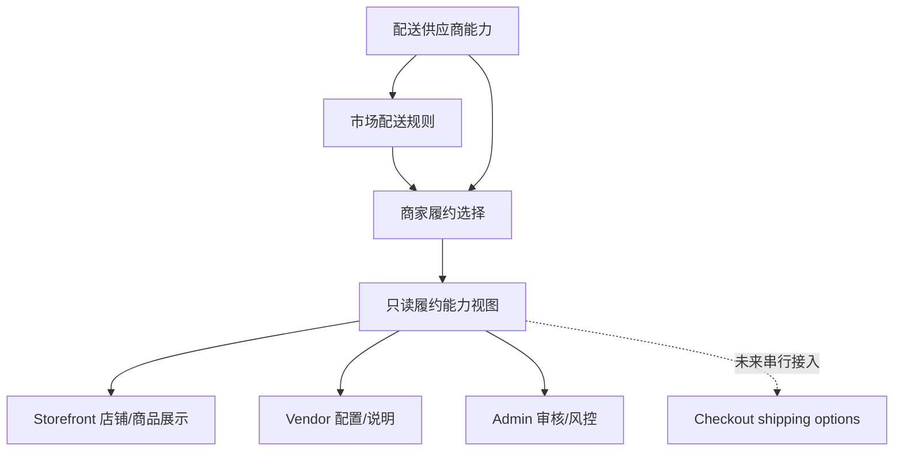
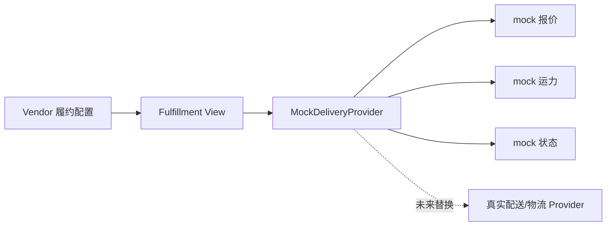

# 商家履约配置后端设计

更新时间：2026-05-07 01:10 Asia/Shanghai

本文档设计商家履约配置如何表达市场统一配送、商家自行配送、商家自提和配送供应商协作。当前阶段只做设计，不写业务代码，不改变 checkout shipping options、order、payment、refund、settlement、commission 或 permission 逻辑。

## 目标

平台需要支持同一个市场内不同商家选择不同履约方式：

- 市场统一配送：市场或平台统一组织配送。
- 商家自行配送：档口自己配送或安排人员配送。
- 商家自提：消费者到市场/档口提货。
- 配送供应商：独立配送供应商接单、派送、反馈状态。
- 冷链/快递：未来电子面单或冷链服务。

用户已明确：市场是否提供统一配送不能强制商家必须使用；平台需要有开关，但商家也应能选择。

## 非目标

- 不改 `shipping option` 选择逻辑。
- 不改 checkout。
- 不改订单状态。
- 不确认发货。
- 不接真实配送供应商。
- 不接快递100、菜鸟、顺丰、京东物流或云打印。
- 不生成真实运单号或真实面单。

## 当前状态

已存在：

- seed 创建了 seller shipping options。
- Storefront 商家页只读展示 seller metadata 中的 `fulfillment_methods`。
- capability contract 中表达了 `market_delivery_options` 等能力。
- Vendor/Admin UI 有配送、快递打印、供应方能力的 mock/placeholder。

当前缺口：

- 没有真实商家履约配置模型。
- 没有市场配送规则和商家选择的结构化关系。
- 没有配送供应商服务范围和报价/接单模型。
- 没有配置到 checkout shipping options 的安全映射。

## 分层模型



第一阶段只做到 `FulfillmentView`，不接 `Checkout`。

## 建议对象

### Market Delivery Rule

市场层能力，表示市场提供哪些配送基础能力。

| 字段 | 说明 |
| --- | --- |
| `market_id` | 市场 ID |
| `rule_key` | `market_pickup` / `market_unified_delivery` / `cold_chain_express` |
| `label` | 中文名称 |
| `status` | enabled / disabled / draft |
| `service_area` | 服务范围，未来结构化 |
| `schedule` | 配送班次，如 10:00 / 15:00 |
| `price_rule` | 运费规则，未来结构化 |
| `requires_supplier` | 是否需要配送供应商 |
| `metadata` | 扩展字段 |

### Seller Fulfillment Profile

商家层选择，表示商家是否使用市场能力或自行配送。

| 字段 | 说明 |
| --- | --- |
| `seller_id` | 商户 ID |
| `market_id` | 市场 ID |
| `mode` | pickup / seller_delivery / market_delivery / supplier_delivery / express |
| `status` | enabled / disabled / paused / draft |
| `is_default` | 是否默认展示 |
| `display_label` | 前台展示文案 |
| `coverage_note` | 覆盖范围说明 |
| `cutoff_time` | 截单时间 |
| `preparation_time` | 备货时间 |
| `requires_operator_review` | 是否需要平台审核 |
| `metadata` | 扩展字段 |

### Delivery Supplier Profile

配送供应商不是普通商品商户。

| 字段 | 说明 |
| --- | --- |
| `seller_id` | 供应商也可复用 seller 主体，但必须有 supplier role |
| `supplier_type` | delivery_supplier |
| `service_markets` | 服务市场 |
| `service_area` | 配送范围 |
| `capacity` | 日/小时承载能力 |
| `status` | pending/open/paused |
| `contact_phone` | 联系电话 |
| `credentials` | 配送资质 |

## 履约方式优先级

建议展示优先级，不代表 checkout 生效：

1. 商品或商家明确声明的履约方式。
2. 商家在当前市场的履约配置。
3. 市场默认配送规则。
4. 平台默认 fallback。

未来 checkout 生效时，优先级应改为严格的规则引擎：

1. 用户地址是否在服务范围。
2. 商品是否支持该履约方式。
3. 商家是否启用该履约方式。
4. 市场是否开放该履约方式。
5. 配送供应商是否可用。
6. 截单时间和营业时间是否满足。
7. 运费计算是否成功。

任何一步失败都必须有可解释的 fallback 或明确不可用原因。

## 与 checkout 的安全边界

当前阶段：

- Storefront 可以展示“支持市场统一配送 / 商家自配送 / 到档自提”。
- Vendor 可以 mock 配置入口。
- Admin 可以只读或 mock 审核入口。
- 不改变 `shipping_methods`、`shipping_options`、cart totals、order fulfillments。

未来接入 checkout 前需要：

- 显式 feature flag。
- 单独 PR。
- shipping option adapter。
- 地址服务范围校验。
- 幂等的运费计算。
- 失败重试和降级。
- 订单创建后的履约快照。
- 配送供应商状态回写边界。

## 配送供应商 Provider 边界

真实配送供应商接入前，先做 mock provider：



Mock provider 只能：

- 返回示例报价。
- 返回示例可用班次。
- 返回示例配送状态。
- 生成 mock tracking id。

Mock provider 禁止：

- 真实下单。
- 真实发货。
- 真实扣费。
- 真实修改订单状态。
- 真实打印面单。

## Admin / Vendor / Storefront 展示建议

Admin：

- 市场配送规则列表。
- 商家履约配置审核。
- 配送供应商服务范围。
- 异常履约监控。
- 只读能力视图。

Vendor：

- 当前市场履约方式。
- 是否启用市场统一配送。
- 是否启用商家自行配送。
- 自提说明。
- 配送供应商合作占位。
- 快递打印 mock 入口。

Storefront：

- 店铺页展示当前档口可用履约方式。
- 商品卡只显示简短标签。
- 商品详情页展示配送说明。
- 结算页在未接真实规则前仍使用现有 shipping options。

## PR 拆分

1. Fulfillment Config Design Doc
   - 仅文档。

2. Fulfillment Read Model Contract
   - 只读类型和 view builder。
   - 不改 checkout。

3. Vendor Fulfillment UI Mock
   - 商家端配置壳。
   - 保存按钮禁用或 mock。

4. Admin Fulfillment Review Mock
   - 平台审核/配置壳。
   - 不写真实配置。

5. Fulfillment Config Storage
   - 真实模型、migration、audit。
   - 中风险，串行。

6. Shipping Option Adapter
   - 高风险，单独 PR。
   - 必须覆盖 checkout/cart/order smoke。

7. Delivery Supplier Provider
   - 先 mock provider。
   - 真实 provider 另开专项。

## 验证计划

文档阶段：

```bash
git diff --check -- docs/vendor-fulfillment-config-design.md project-ledger .codex/queue.md
```

未来只读 API：

```bash
cd packages/api
../../node_modules/.bin/tsc --noEmit -p tsconfig.json
./node_modules/.bin/medusa build
```

未来 UI：

```bash
bun --cwd apps/vendor run lint
bun --cwd apps/vendor run build
bun --cwd apps/admin run lint
bun --cwd apps/admin run build
bun --cwd apps/storefront run build
```

未来 checkout 接入：

```bash
# 必须补 cart + shipping + order smoke
# 必须验证无地址、超服务范围、配送供应商不可用、重复提交
```

## 风险点

- 一旦配送规则影响 checkout，就会触碰 cart total、shipping methods 和 order flow。
- 配送供应商接单可能触碰订单履约和消息通知。
- 快递打印可能触碰真实物流、电子面单、运单号和发货状态。
- 商家自配送如果和市场统一配送并存，需要清晰的优先级和失败 fallback。
- 不能把配送供应商当普通消费者商品商户展示。

## 当前结论

本轮只确认履约配置的模型和安全边界。下一步可以继续做 `integration-release-readiness`，把当前 integration 分支拆 PR 风险和未跟踪文件边界整理出来；不要直接实现 checkout 配送规则。
