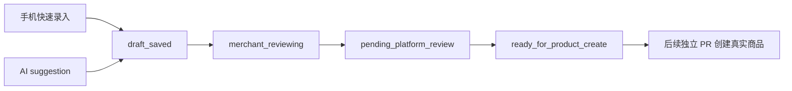

# Vendor Mobile Draft Product Readiness

更新时间：2026-05-08 18:22 Asia/Shanghai

## 结论

手机快速上架应该先落在“商品草稿”层，不应该直接创建真实商品。

原因：

- 商户手机上架需要像 App 一样快，不能复制 PC 端完整表单。
- 价格、规格、单位、库存、履约和类目仍需要后台模板约束。
- AI 一句话上架可以提高效率，但只能生成建议字段，不能自动发布商品。
- 真正创建 Medusa product 会碰到审核、库存、图片、权限和审计，必须单独 PR。

## 手机端最小字段

手机端首屏只建议保留：

| 字段 | 说明 |
| --- | --- |
| 商品名 | 必填，可由 AI 草稿建议 |
| 类目 | 必填，来自市场/商户类型可用类目 |
| 规格模板 | 必填或按类目默认，来自后台只读模板 |
| 价格 | 支持固定价、区间价、时价占位 |
| 销售单位 | 例如 斤、箱、份、袋 |
| 库存说明 | 可先是文本或轻量数量 |
| 图片 | 可先保存临时引用，不做真实对象转存 |
| 履约提示 | 自提、商家配送、市场配送的只读提示 |

手机端不应要求商户一次性填写：

- 复杂 SEO。
- 多层属性。
- 完整库存批次。
- 完整运费模板。
- 结算或佣金字段。
- 权限或角色配置。

## 规格模板边界

规格以后应该读取后台配置，而不是写死在手机端。

模板来源建议：

- 平台级规格模板。
- 市场级规格模板。
- 商户类型适用范围。
- 类目适用范围。
- 试点状态。

手机端只消费模板，不编辑模板。

## AI 草稿边界

AI 输入来源可以预留：

- 一句话文本。
- 微信消息转发文本。
- 语音转文本结果。
- 图片识别结果。

当前阶段只允许 mock / suggestion：

- AI 输出写入 `suggested_fields`。
- 商户确认后才写入草稿字段。
- suggestion 必须保留 provider、source digest、confidence 和 warnings。
- AI 不直接提交审核。
- AI 不直接发布真实商品。
- AI 不接真实微信、语音、图片识别或外部大模型密钥。

## 草稿状态分层

重要边界：

- `draft_saved` 不是商品。
- `pending_platform_review` 不是商品。
- `ready_for_product_create` 也不是商品，只是候选。
- 创建真实商品必须单独经过 Product Creation Workflow。

## 必须验证的前置条件

创建真实商品前必须验证：

- 当前用户属于该 seller。
- seller 属于当前市场或被允许跨市场。
- seller 当前角色允许发布该类商品。
- 类目和规格模板匹配。
- 价格单位、销售单位、库存单位不冲突。
- 图片引用已经安全转存或可读取。
- 食品安全、产地、活鲜/冻品等风险字段已确认。
- 所有关键状态变化有 audit。

## 后续 PR 顺序

1. `vendor-mobile-draft-product-contract`
   - 新增纯 TypeScript draft view shape。
   - 不新增 route。

2. `vendor-spec-template-readonly-contract`
   - 定义手机端可消费的规格模板只读 contract。
   - 不保存模板。

3. `vendor-ai-draft-suggestion-contract`
   - 定义 AI mock suggestion 输入输出。
   - 不接真实 AI 或微信。

4. `vendor-draft-product-api-skeleton`
   - 新增草稿 API skeleton。
   - 只写草稿，不创建真实商品。

5. `vendor-draft-product-audit-contract`
   - 固化草稿状态变化审计。
   - 不接权限系统。

6. `vendor-draft-ready-for-product-create-plan`
   - 规划从候选到真实商品创建的高风险流程。
   - 暂不创建真实商品。

## 风险点

- 手机端越简单，后端模板约束越重要。
- AI 建议必须可追溯、可撤回、可覆盖。
- 快速上架不能绕过商品审核。
- 规格模板不能和真实库存、价格单位混在一起。
- 真实商品创建是中高风险任务，不能和 UI polish 混 PR。
