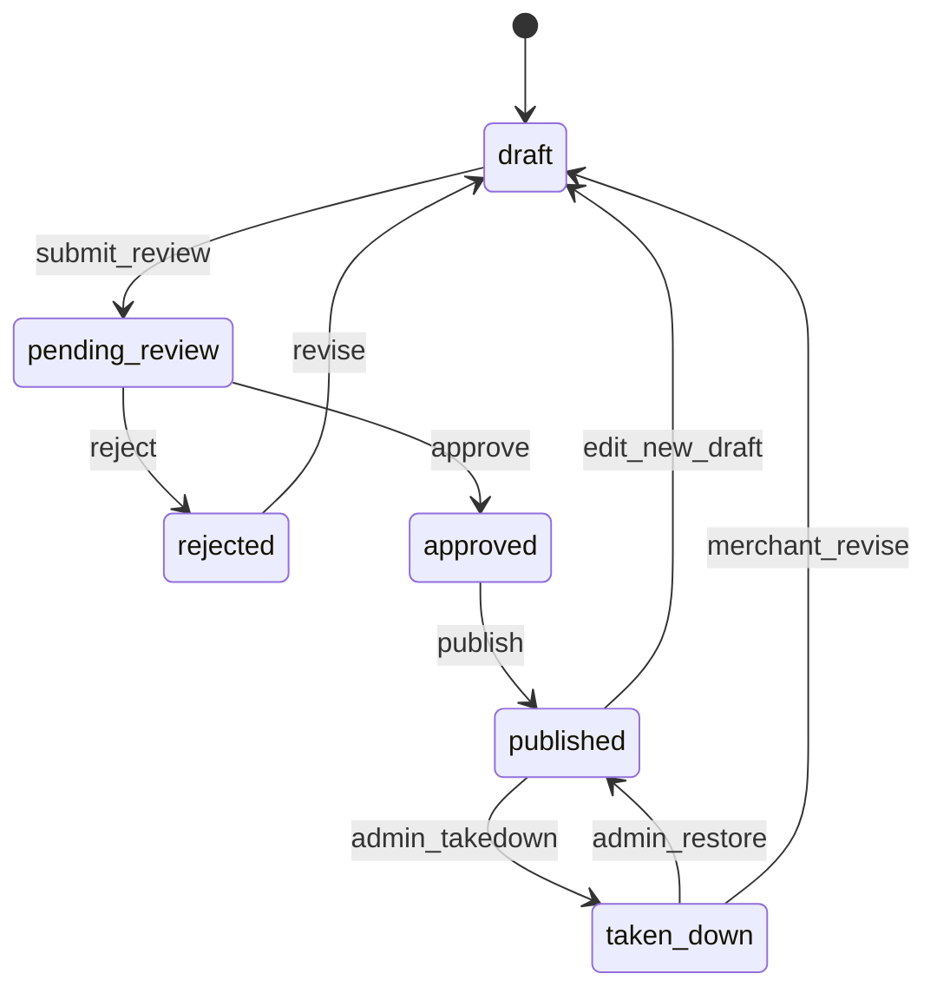

# Vendor 店铺/档口装修 API 与数据模型设计

日期：2026-05-04

## 目标

为 Vendor 店铺/档口装修设计后端 API 和数据模型草案。本文只写设计，不创建 API、不写 migration、不接真实文件上传、真实直播、IM、短信、物流，也不改变商品、订单、支付、退款、结算、佣金或权限业务逻辑。

店铺装修面向生鲜市场里的商户、档口和跨市场经营主体，后端需要支持草稿保存、发布审核、预览、资质展示、商品分组、公告、配送说明、直播状态展示和审计日志。第一版应服务当前 Vendor mock UI 后续落地，而不是直接替换现有 Mercur/Medusa core。

## 核心原则

- 店铺装修是商户运营资料，不是商品上架、交易、支付或履约事实来源。
- 商户只能创建和编辑自己有权限的店铺、市场和档口装修。
- 已发布版本必须来自审核通过的不可变快照。
- 草稿、预览、提交审核、发布、下架和恢复都必须可审计。
- 店铺资质展示只引用平台已保存或已审核的资质记录，不在本任务接入真实文件上传服务。
- 商品分组只引用商户有权展示的商品，不修改商品状态、库存、价格、类目或审核状态。
- 直播状态只保存展示状态和 mock/provider 引用，不接真实直播、推流、IM、支付或带货交易。
- 模块开关关闭时，后端必须拒绝对应写操作；前端隐藏不是权限控制。

## 范围与非目标

范围：

- 店铺/档口装修实体、版本、模块快照和状态机。
- Vendor 草稿保存、提交审核、预览和发布申请 API 草案。
- Admin 审核、驳回、下架、恢复和审计 API 草案。
- Storefront 只读公开读取和预览读取边界。
- 资质、商品分组、公告、配送说明、直播状态展示的数据合同。
- 权限边界、审计日志、幂等和后续 PR 拆分。

非目标：

- 不实现业务代码。
- 不新增数据库 migration。
- 不上传真实文件，不接对象存储/CDN。
- 不接真实直播、IM、短信、物流或快递打印服务。
- 不修改商品、库存、订单、支付、退款、结算、佣金或权限逻辑。
- 不把店铺装修发布结果作为商户资质审核通过或商品审核通过的依据。

## 店铺装修状态机

状态说明：

- `draft`：商户可编辑草稿，不对消费者公开。
- `pending_review`：商户提交审核，内容快照冻结。
- `approved`：平台审核通过，允许发布或按计划发布时间发布。
- `rejected`：平台驳回，必须记录原因；商户可复制回草稿修改。
- `published`：消费者可见的当前版本。
- `taken_down`：平台下架，消费者不可见，保留已发布快照和原因。

## 建议数据模型

### VendorShopDecorationProfile

店铺/档口装修主档，表示某个商户在某个市场或档口下的装修空间。

字段：

- `id`
- `vendor_id`
- `market_id`
- `stall_id`
- `stall_no`
- `merchant_type`: `fresh_stall`、`frozen_goods`、`dry_goods`、`fruit_vegetable`、`materials_supplier`、`delivery_supplier`、`farmer_grower`、`seedling_supplier`、`wholesaler`
- `display_name`
- `handle`
- `status`: `active`、`hidden`、`suspended`
- `draft_version_id`
- `published_version_id`
- `latest_review_status`
- `module_flags_snapshot`
- `created_by`
- `updated_by`
- `created_at`
- `updated_at`

约束：

- `vendor_id + market_id + stall_id` 建议唯一；跨市场经营商户应创建多个 profile，并通过商户-市场绑定关系关联。
- `handle` 仅用于公开 URL 或 SEO 友好标识，不能作为权限判断依据。
- `module_flags_snapshot` 只用于展示和审计，真实能力判断仍以后台模块开关 API 为准。

### VendorShopDecorationVersion

装修版本。草稿、审核快照、预览和发布都围绕版本运转。

字段：

- `id`
- `profile_id`
- `version_no`
- `status`: `draft`、`pending_review`、`approved`、`rejected`、`published`、`archived`、`taken_down`
- `snapshot`
- `review_status`
- `review_reason`
- `submitted_by`
- `submitted_at`
- `reviewed_by`
- `reviewed_at`
- `published_by`
- `published_at`
- `taken_down_by`
- `taken_down_at`
- `take_down_reason`
- `created_by`
- `updated_by`
- `created_at`
- `updated_at`

`snapshot` 建议保存不可变模块数组，避免发布后被草稿修改影响消费者页面。后续实现时可在模型成熟后拆成结构化模块表，但第一版 API 合同应以快照为核心，便于预览和回滚。

### VendorShopDecorationModule

如果后续拆结构化模块，可用如下通用模型；第一版也可作为 `snapshot.modules[]` 的 schema。

字段：

- `id`
- `version_id`
- `type`: `hero`、`announcement`、`today_fresh`、`product_group`、`credential_showcase`、`delivery_note`、`live_status`、`market_notice`
- `title`
- `sort_order`
- `visibility`: `public`、`preview_only`、`hidden`
- `content`
- `created_at`
- `updated_at`

模块要求：

- `hero`：保存头图 object key/reference、标题、副标题、市场名、档口号和营业时间文案。
- `announcement`：保存公告标题、内容、生效时间、失效时间和置顶状态。
- `today_fresh`：保存今日鲜货商品引用列表和运营文案，不复制真实价格事实。
- `product_group`：保存商品分组标题、商品引用、排序和展示标签。
- `credential_showcase`：保存资质引用、展示名称、有效期和展示状态。
- `delivery_note`：保存配送/自提说明、服务范围摘要和冷链提示。
- `live_status`：保存直播展示状态、mock/provider 引用、预告时间、回放入口占位。

### VendorShopAnnouncement

用于高频公告管理时的结构化表，也可先存在版本快照内。

字段：

- `id`
- `profile_id`
- `title`
- `body`
- `status`: `draft`、`pending_review`、`approved`、`published`、`expired`、`hidden`
- `pinned`
- `starts_at`
- `ends_at`
- `created_by`
- `reviewed_by`
- `review_reason`
- `created_at`
- `updated_at`

边界：

- 公告不应触发订单、库存、售后、支付或物流状态变化。
- 高风险词、食品安全承诺、赔付承诺和价格承诺应进入审核。

### VendorShopProductGroup

字段：

- `id`
- `profile_id`
- `version_id`
- `name`
- `description`
- `group_type`: `today_fresh`、`hot_sale`、`seasonal`、`pickup_available`、`materials`、`custom`
- `product_refs`
- `sort_order`
- `status`: `draft`、`published`、`hidden`
- `created_at`
- `updated_at`

校验：

- `product_refs` 必须属于当前 vendor 可见且允许展示的商品。
- 分组只控制店铺主页展示，不改变商品上架状态、价格、库存或类目。
- 物料供应商分组不得混入普通消费者购买主链路，除非后续有专门 B 端采购入口设计。

### VendorShopCredentialDisplay

字段：

- `id`
- `profile_id`
- `credential_ref_id`
- `credential_type`: `business_license`、`food_business_license`、`origin_certificate`、`inspection_report`、`cold_chain_certificate`、`delivery_certificate`、`seedling_license`、`farming_certificate`
- `display_name`
- `display_status`: `hidden`、`pending_review`、`approved_display`、`rejected_display`、`expired`
- `valid_from`
- `valid_until`
- `redaction_level`: `public_summary`、`masked_image`、`admin_only`
- `reviewed_by`
- `review_reason`
- `created_at`
- `updated_at`

边界：

- 店铺装修只引用资质，不验证资质真实性。
- 消费者公开页只能展示通过展示审核且已脱敏的资质摘要或图片。
- 过期、撤销、审核未通过资质不得在公开发布版本展示。

### VendorShopLiveStatus

字段：

- `id`
- `profile_id`
- `status`: `offline`、`scheduled`、`live`、`paused`、`replay_available`、`suspended`
- `provider`: `mock_live`、`external_placeholder`
- `provider_room_ref`
- `scheduled_at`
- `started_at`
- `ended_at`
- `replay_ref`
- `admin_review_status`
- `risk_reason`
- `updated_by`
- `updated_at`

边界：

- 第一阶段只做展示状态和 provider 引用。
- 不保存真实推流地址、真实 IM 房间密钥、真实回放文件或支付相关链接。
- 平台可暂停或隐藏直播状态展示，必须记录原因。

### VendorShopDecorationAuditLog

字段：

- `id`
- `profile_id`
- `version_id`
- `actor_id`
- `actor_role`: `vendor_user`、`admin_user`、`system`
- `action`
- `before_status`
- `after_status`
- `changed_paths`
- `reason`
- `request_id`
- `idempotency_key`
- `ip_digest`
- `user_agent_digest`
- `created_at`

必须记录：

- 草稿创建、草稿保存、提交审核、审核通过、审核驳回、发布、下架、恢复、复制历史版本、预览 token 创建。
- 资质展示状态变更、公告审核、直播状态隐藏或恢复。
- 所有平台审核动作必须有 `reason` 或审核备注。

## API 草案

### Vendor API

- `GET /vendor/china/shop-decoration/profiles`
- `GET /vendor/china/shop-decoration/profiles/:profile_id`
- `POST /vendor/china/shop-decoration/profiles/:profile_id/drafts`
- `GET /vendor/china/shop-decoration/profiles/:profile_id/drafts/current`
- `PATCH /vendor/china/shop-decoration/versions/:version_id`
- `POST /vendor/china/shop-decoration/versions/:version_id/submit-review`
- `POST /vendor/china/shop-decoration/versions/:version_id/preview-token`
- `POST /vendor/china/shop-decoration/versions/:version_id/cancel-review`
- `POST /vendor/china/shop-decoration/versions/:version_id/publish-request`
- `POST /vendor/china/shop-decoration/versions/:version_id/copy-to-draft`
- `GET /vendor/china/shop-decoration/audit-logs?profile_id=...`

Vendor 写接口要求：

- 校验当前用户属于 `vendor_id`，且商户拥有 `market_id/stall_id` 经营关系。
- 校验店铺装修模块开关已开启。
- 使用乐观锁或 `version_no` 防止多端编辑覆盖。
- 对 `PATCH`、`submit-review`、`publish-request` 支持 `Idempotency-Key`。
- 写操作仅影响装修版本和审计日志，不修改商品、订单、支付、退款、结算、佣金。

### Admin API

- `GET /admin/china/shop-decoration/reviews`
- `GET /admin/china/shop-decoration/profiles/:profile_id`
- `GET /admin/china/shop-decoration/versions/:version_id`
- `POST /admin/china/shop-decoration/versions/:version_id/approve`
- `POST /admin/china/shop-decoration/versions/:version_id/reject`
- `POST /admin/china/shop-decoration/versions/:version_id/takedown`
- `POST /admin/china/shop-decoration/versions/:version_id/restore`
- `POST /admin/china/shop-decoration/credentials/:display_id/review`
- `POST /admin/china/shop-decoration/live-status/:id/suspend`
- `POST /admin/china/shop-decoration/live-status/:id/restore`
- `GET /admin/china/shop-decoration/audit-logs`

Admin 写接口要求：

- 必须经过平台运营后台权限判断。
- 审核、驳回、下架和恢复必须记录原因。
- 下架只能影响装修公开展示，不得修改商户商品、订单、支付、退款、结算或佣金。
- 恢复必须确认被恢复版本仍符合当前模块开关和资质展示策略。

### Storefront/Public API

- `GET /store/china/shops/:handle/decoration`
- `GET /store/china/shops/:handle/decoration/preview?token=...`
- `GET /store/china/markets/:market_id/stalls/:stall_no/decoration`

公开读取要求：

- 默认只返回 `published` 且未 `taken_down` 的版本。
- 预览 token 只返回指定版本快照，有过期时间，不允许搜索引擎索引。
- 不返回未脱敏资质、内部审核原因、后台备注、真实 provider 密钥或对象存储私有信息。

## 预览设计

预览 token 建议字段：

- `id`
- `version_id`
- `profile_id`
- `token_digest`
- `expires_at`
- `created_by`
- `created_at`
- `revoked_at`

规则：

- token 只保存 digest，不保存明文。
- 默认短有效期，例如 30 分钟或 2 小时，由后续产品配置决定。
- 预览不改变审核状态，不创建发布版本，不触发通知。
- 预览可展示 `pending_review` 或 `rejected` 版本，但必须带 `preview_only` 标识。

## 权限边界

Vendor：

- 只能读取和编辑自己 vendor 旗下、且绑定到当前市场/档口的 profile。
- 不能审核、强制发布、下架或恢复。
- 不能展示未通过展示审核的资质。
- 不能通过装修 API 修改商品状态、库存、价格、订单、支付、退款、结算或佣金。

Admin：

- 可查看审核队列、版本快照和审计日志。
- 可审核、驳回、下架、恢复装修版本和资质展示。
- 不能绕过现有商户归属、RBAC、资金和订单权限边界。
- 高风险资质处置和直播违规处置应保留独立权限点。

System：

- 可按计划发布时间把 `approved` 版本切到 `published`。
- 可按资质过期、模块关闭或风控策略隐藏模块，但必须写审计日志。

## 审核规则草案

建议第一版审核覆盖：

- 店铺名、头图、公告、配送说明是否包含违规承诺、虚假宣传或联系方式外流。
- 商品分组中的商品是否属于当前商户，且不是已删除、已下架或无权展示商品。
- 资质是否已脱敏、未过期、展示范围合规。
- 直播状态是否来自允许的 mock/provider 引用，且无真实密钥或推流地址。
- 市场、档口号和跨市场经营关系是否与平台配置一致。

审核结果：

- `approve`：冻结审核快照，允许发布。
- `reject`：保留驳回原因，商户复制回草稿修改。
- `takedown`：对已发布版本下架，保留消费者不可见状态和原因。
- `restore`：恢复前必须重新校验当前模块开关、商户状态和资质展示状态。

## 幂等、并发和回滚

- 所有状态变更接口建议支持 `Idempotency-Key`。
- 草稿更新建议使用 `version_no` 或 `updated_at` 做乐观锁。
- 发布时只切换 `published_version_id`，不覆盖历史版本。
- 下架时保留 `published_version_id` 和下架原因，便于恢复或审计。
- 回滚可通过 `copy-to-draft` 从历史版本生成新草稿，再走审核流程；紧急恢复由 Admin `restore` 控制。

## 后续 PR 拆分

### PR D0: 本设计文档

Scope:

- 新增 `docs/vendor-shop-decoration-api-design.md`。
- 更新 `docs/china-localization-task-list.md`、`.codex/queue.md` 和进度板状态。

Verification:

- `git diff -- docs/vendor-shop-decoration-api-design.md docs/china-localization-task-list.md .codex/queue.md docs/china-localization-progress-board.md`
- 人工确认未修改 `apps/**`、`packages/**`、`package.json`、`bun.lock`。

Risk:

- 低。仅文档设计。

### PR D1: 模型与 migration 草案

Scope:

- 设计并落地装修 profile、version、preview token、audit log 的数据库模型。
- 暂不接真实文件上传、真实直播或商品发布。

Verification:

- migration dry-run。
- 单元测试覆盖唯一约束、状态枚举和历史版本不可变。

Risk:

- 中。模型落库后会成为长期约束，必须单独评审。

### PR D2: Vendor 草稿与预览 API

Scope:

- 实现 Vendor 草稿保存、提交审核、预览 token、复制历史版本。
- 校验 vendor/market/stall 归属和模块开关。

Verification:

- 商户只能访问自己的装修草稿。
- 模块关闭时写操作被拒绝。
- 预览 token 过期后不可访问。

Risk:

- 中。涉及商户数据隔离和公开预览。

### PR D3: Admin 审核、下架与恢复 API

Scope:

- 实现 Admin 审核队列、通过、驳回、下架、恢复和审计日志查询。
- 保持权限点独立，不夹带商品、订单或资金逻辑。

Verification:

- 审核原因必填测试。
- 下架后公开 API 不返回该版本。
- 恢复前重新校验模块开关和商户状态。

Risk:

- 中到高。涉及平台运营权限和消费者可见内容。

### PR D4: Storefront 只读公开与预览读取

Scope:

- Storefront 读取已发布装修快照和预览快照。
- 公开响应脱敏资质和隐藏内部审核信息。

Verification:

- 发布版本可读。
- 草稿不可被普通公开 API 读取。
- 预览 token 不泄露后台备注、私有 object key 或审核原因。

Risk:

- 中。公开 API 需要严格脱敏。

### PR D5: 资质、公告、商品分组和直播状态深化

Scope:

- 结构化资质展示、公告、商品分组、直播状态管理。
- 保持 mock/provider 引用，不接真实直播和 IM。

Verification:

- 资质过期或未审核不公开展示。
- 商品分组不能引用其他商户商品。
- 直播状态不包含真实推流地址或密钥。

Risk:

- 中。涉及公开信任信息和供应商类型边界。

## 验证要求

本文档任务完成时：

- 只允许修改 `docs/vendor-shop-decoration-api-design.md`、`docs/china-localization-task-list.md`、`.codex/queue.md`、`docs/china-localization-progress-board.md`。
- 使用 `git diff -- ...` 检查文档 diff。
- 使用 `git status --short` 确认未新增或修改禁止范围文件。
- 人工确认文档未写入真实密钥、真实 provider 参数、真实直播推流地址或真实对象存储 URL。
