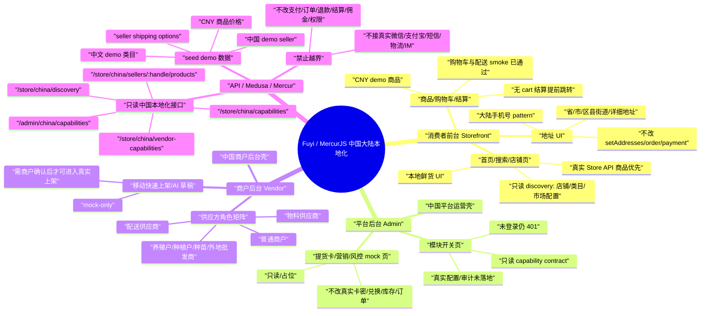
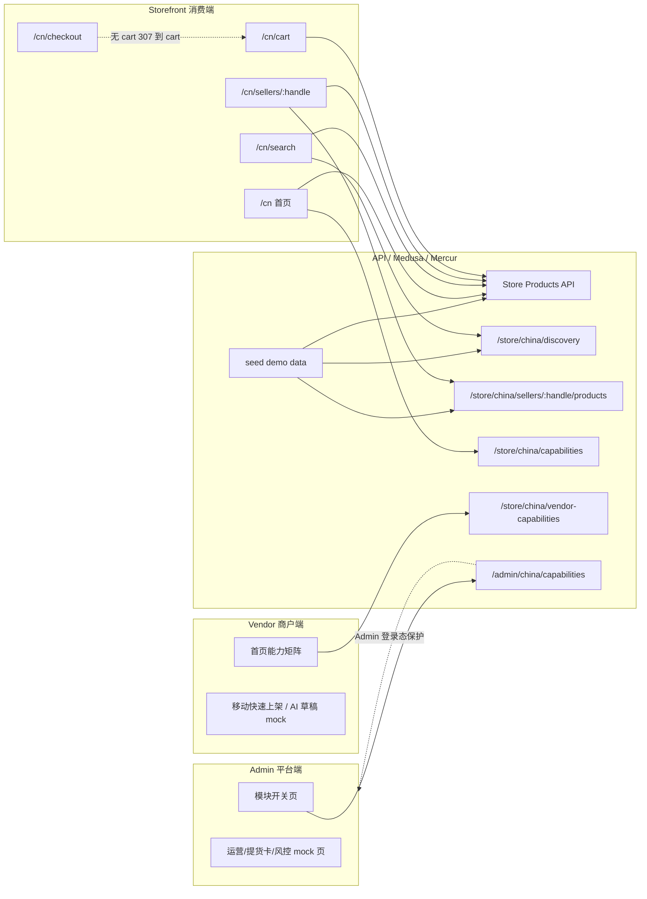
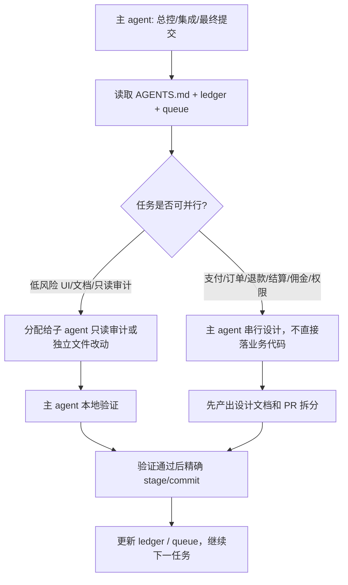

# 中国本地化系统地图

更新时间：2026-05-07 00:38 Asia/Shanghai

本文档记录当前 `china/integration-localization` worktree 的系统地图、已跑通链路、下一阶段任务边界和多 agent 分工原则。它是 `project-ledger/status.md` 的结构化补充。

## 当前总览

## 当前数据流

## 已完成节点

| 区域 | 当前状态 | 验证 |
| --- | --- | --- |
| API seed | 中国 demo seller、CNY 商品、配送选项、中文 demo 类目 | `seed-api.sh`、API tsc/build、Store API smoke |
| Storefront | 首页/搜索/店铺/商品/购物车/地址 UI 第一层收口 | Storefront build、HTTP smoke、cart/shipping smoke |
| Admin | 中国运营壳、只读模块开关、能力契约读取 | Admin lint/build、未登录 capability 401 |
| Vendor | 商户后台壳、供应方矩阵、只读能力契约 | Vendor lint/build、7001 smoke |
| Provider skeleton | Mock Chat/SMS/Logistics/Live/AI Listing skeleton | mock-only，不注册真实服务 |
| 文档/任务流 | queue、ledger、任务文件、地址任务编码修复 | diff check、全栈验证记录 |

## 下一阶段边界

### 仍可低风险继续

- 文档和任务拆分：市场模型、模块开关配置存储、商户类型、配送规则、供应商角色。
- UI 只读展示和 mock 数据抽离。
- 视觉 QA 和人工确认清单。
- seed/demo 数据继续本地化，但必须标明不是生产数据来源。
- Provider mock contract 补充测试，仍不注册真实服务、不接真实第三方。

### 进入中高风险，只能先设计

- 真实市场模型：市场、档口、商户跨市场、营业时间、公告、配送规则。
- Admin 模块开关真实存储与审计。
- 商户类型开关真正影响菜单、权限、接单、履约能力。
- 商家履约配置真正影响 checkout shipping options。
- 快递打印真实面单、物流轨迹、揽收、取消。
- AI 上架草稿进入真实商品创建 workflow。

### 必须串行的高风险

- Mock China Payment Provider 从 mock 到支付框架。
- 支付通知幂等框架。
- 支付宝 Provider。
- 微信支付 Provider。
- 退款。
- 对账。
- 商家结算、payout、commission。

这些任务不得和普通 UI PR 混合，不得并行随意推进。

## 多 Agent 分工规则

规则：

- 主 agent 对整体架构、边界和最终提交负责。
- 子 agent 优先做只读审计、风险复核、独立文档或不重叠文件改动。
- 子 agent 不直接 push，不直接改高风险业务逻辑。
- 每轮结束必须更新 `project-ledger/status.md` 或相关任务文档。
- 任务完成后继续队列，除非遇到安全边界、验证失败或需要人工视觉确认。

## 第十轮建议队列

1. `market-model-backend-design`
   - 只做文档设计：市场、档口、跨市场商户、营业时间、公告、配送规则、商户类型。
   - 不写业务代码。

2. `admin-module-config-contract-design`
   - 只做文档设计：模块开关真实存储、审计、回滚、只读能力视图到可配置能力视图的演进。
   - 不让开关真实生效。

3. `vendor-fulfillment-config-design`
   - 只做文档设计：统一配送/商家自配送/供应商配送配置如何表达，未来如何安全影响 checkout。
   - 不改 shipping option 逻辑。

4. `integration-release-readiness`
   - 检查当前 integration 分支哪些提交可以进入 PR，哪些还需要拆分。
   - 不 push，不创建 PR。

## 当前结论

本项目已经从“纯 UI mock 本地化”推进到“只读后端契约 + demo 数据链路 + 三端中国化壳”的阶段。下一步应先补齐真实市场/模块/履约配置的设计文档，再进入任何会影响权限、履约、订单或支付状态的实现。
